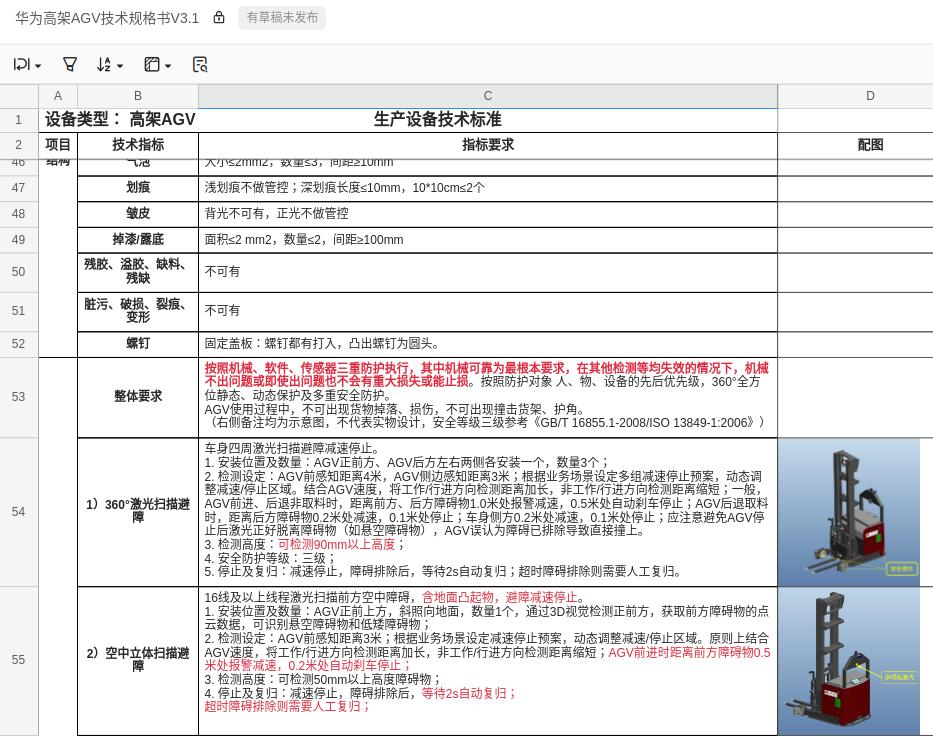
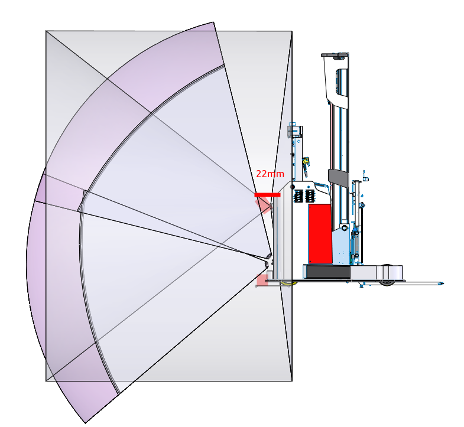
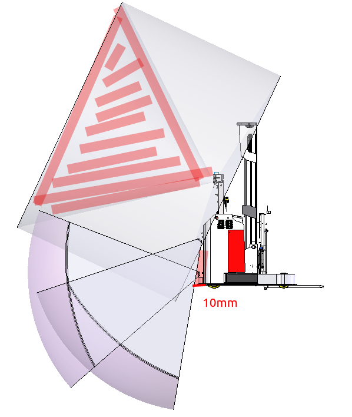
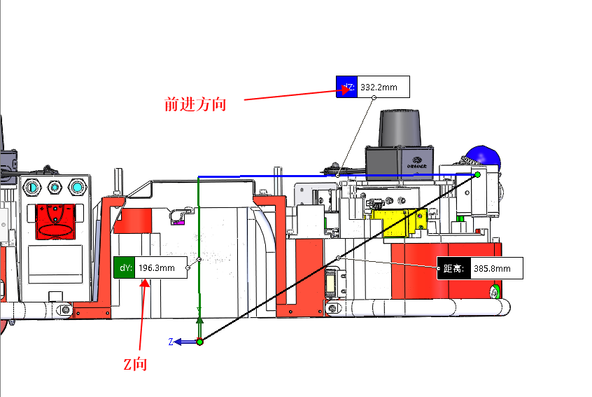
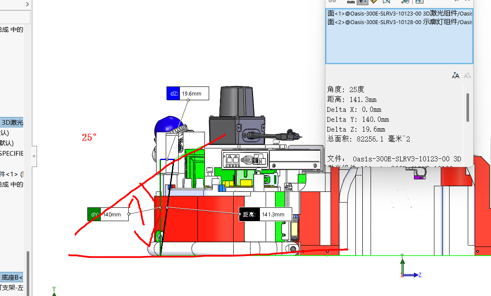

## **方案一**

**安装方式：**

mid360 ：居中,    1200mm高度，竖直安装；

上侧大白：居中， 300mm高度； ==主要用途==：用于mid360的补盲

下侧大白：居中， 300mm高度； ==主要用途==：用于低矮障碍物的检测

**盲区：**

 红色标注区域（两处），最远盲区22mm；

**备注：**

多线激光雷达会侧边扫描360, 处于车左右侧近距离也可以扫描的到（人脚），避障相机则不行；

## 方案二

**安装方式：**

mid360 ：安装导航立柱上，居中 ，向下倾斜30°  

上侧大白：居中，1000mm高度   ==主要用途==：用于辅助低矮障碍物的检测

下侧大白：居中， 300mm高度    ==主要用途==：用于低矮障碍物的检测

**盲区：**

 红色标注区域，底部三角区域最远盲区10mm；

**备注：**

车体上部分盲区太多，导航立柱前方探测不到，需要格外加相机补盲，优势是两个相机向下倾斜安装增加了小障碍物的检测能力；

#### mid360避障

