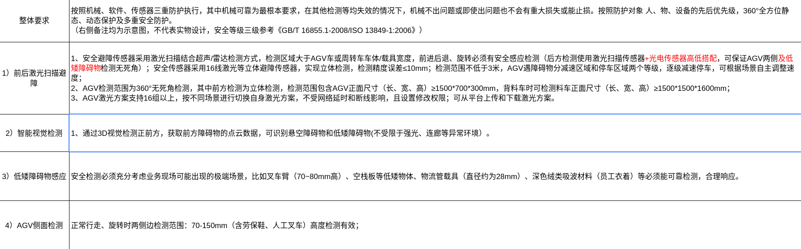
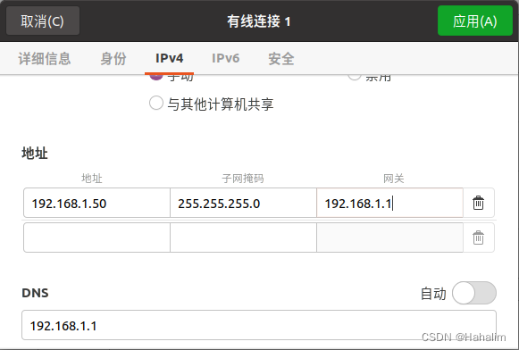
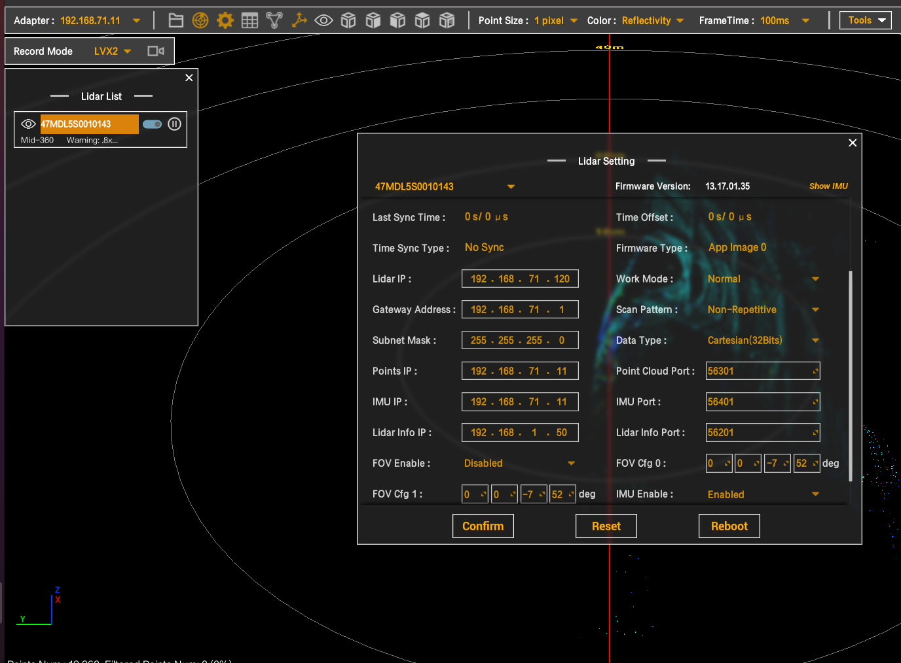
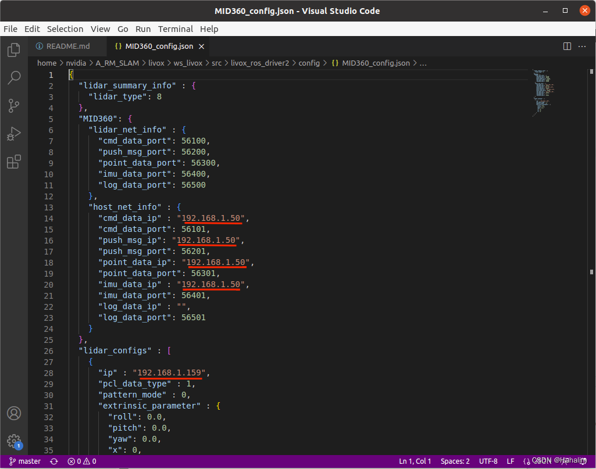

ig


## **方案一**

**安装方式：**

mid360 ：居中,    1200mm高度，竖直安装；

上侧大白：居中， 300mm高度； ==主要用途==：用于mid360的补盲

下侧大白：居中， 300mm高度； ==主要用途==：用于低矮障碍物的检测

**盲区：**

 红色标注区域（两处），最远盲区22mm；

**备注：**

多线激光雷达会侧边扫描360, 处于车左右侧近距离也可以扫描的到（人脚），避障相机则不行；


## 方案二

**安装方式：**

mid360 ：安装导航立柱上，居中 ，向下倾斜30°  

上侧大白：居中，1000mm高度   ==主要用途==：用于辅助低矮障碍物的检测

下侧大白：居中， 300mm高度    ==主要用途==：用于低矮障碍物的检测

**盲区：**

 红色标注区域，底部三角区域最远盲区10mm；

**备注：**

车体上部分盲区太多，导航立柱前方探测不到，需要格外加相机补盲，优势是两个相机向下倾斜安装增加了小障碍物的检测能力；


#### mid360避障


华为框架协议O车



[**工作项**](https://standard-robots.yuque.com/hw-ee/xmsxu3/vvzuo6ei04rbsea7)

- [ ] 3D避障相机避障功能开发及测试；
- [ ] 多线激光雷法避障算法ros仿真(预处理，地面提取，障碍物聚类)；
- [ ] mid360驱动数据接入；
- [ ] 多线激光雷法避障算法sros集成；
- [ ] 异常情况处理(货架黑色静电链晃动);
- [ ] 框架协议避障指标整体测试评估及文档输出；


### MID360使用说明

> livox的mid360目前部署在小车是通过交换机连接的，获取原始数据方式有以下三种方式：
>
> 1.通过官方的Livox Viewer2可视化工具获取数据；
>
> 2.通过安装Livox-SDK2的ros驱动来获取数据；
>
> 3.通过订阅的方式获取集成到SROS平台里面的驱动数据；


#### 0.前置工作

 确保上位机/ROS驱动置于和雷达IP同一局域网下

修改主机地址

```
sudo ifconfig
sudo ifconfig enp2s0 192.168.1.50 //将enp6s0换成雷达和电脑的以太网有线连接的名称
```

或者在设置中修改以太网ip



#### 1.Livox Viewer2使用方式

- [**Livox Viewer2下载链接**](https://www.livoxtech.com/downloads)
- 正确连接雷达硬件并完成IP配置后运行指令`./livox viewer.sh`启动Livox Viewer2
- IP配好后会刷新Lidar List
- 通过界面设置可以查询到Lidar IP




#### 2.Livox-SDK2使用方法

- **安装Livox-SDK2:**

```shell
git clone https://github.com/Livox-SDK/Livox-SDK2.git
cd ./Livox-SDK2/
mkdir build
cd build
cmake .. && make -j8
sudo make install
```

- **安装livox_ros_driver2:**

```shell
git clone https://github.com/Livox-SDK/livox_ros_driver2.git ws_livox/src/livox_ros_driver2
cd ws_livox
source /opt/ros/noetic/setup.sh
./build.sh ROS1
```

- 更改livox_ros_driver2/config/MID360_config.json文件内参数




#### 3.SROS集成Livox-SDK2使用方法


5.12.0-alpha(eb75193)[v5.12.0-alpha

