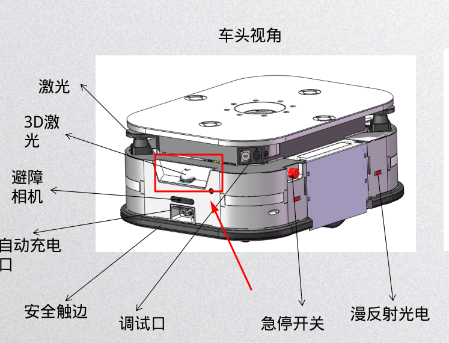

## **方案一**

**安装方式：**

mid360 ：居中,    1200mm高度，竖直安装；

上侧大白：居中， 300mm高度； ==主要用途==：用于mid360的补盲

下侧大白：居中， 300mm高度； ==主要用途==：用于低矮障碍物的检测

**盲区：**

 红色标注区域（两处），最远盲区22mm；

**备注：**

多线激光雷达会侧边扫描360, 处于车左右侧近距离也可以扫描的到（人脚），避障相机则不行；

## 方案二

**安装方式：**

mid360 ：安装导航立柱上，居中 ，向下倾斜30°  

上侧大白：居中，1000mm高度   ==主要用途==：用于辅助低矮障碍物的检测

下侧大白：居中， 300mm高度    ==主要用途==：用于低矮障碍物的检测

**盲区：**

 红色标注区域，底部三角区域最远盲区10mm；

**备注：**

车体上部分盲区太多，导航立柱前方探测不到，需要格外加相机补盲，优势是两个相机向下倾斜安装增加了小障碍物的检测能力；

#### mid360避障

华为框架协议O车

[**工作项**](https://standard-robots.yuque.com/hw-ee/xmsxu3/vvzuo6ei04rbsea7)

- [ ] 3D避障相机避障功能开发及测试；
- [ ] 多线激光雷法避障算法ros仿真(预处理，地面提取，障碍物聚类)；
- [ ] mid360驱动数据接入；
- [ ] 多线激光雷法避障算法sros集成；
- [ ] 异常情况处理(货架黑色静电链晃动);
- [ ] 框架协议避障指标整体测试评估及文档输出；

**前置储备:**

- 目前20hz 1000点/hz ;
- 目前需要在最新的main才修复了mid360的适配;
- 地面盲区最近40,即小障碍物的最近检测为40左右 ;
- 地面的一致性很高 标定好的情况下地面相对误差在1cm内;

问题点:

- [ ] 现象:mid360近距离固定区域附近有噪点(团状),原因未查明?  

  原因:

  ​	解决思路:1.固定滤波 2.模板匹配 3.按照2D激光处理思路,连续几度距离不能太远

#### mid360连接排查

1. 查看雷达是否转动,雷达通电就会开启,有些时候会断线;

2. 查看硬件状态是否连通,如果没联通去后台配置到数据库;

3. 雷达的ip是固定不动的,连交换机情况,vc400的本机ip :192.168.71.50 雷达的ip: **192.168.71.120**     

   雷达的ip是固定不动的,不连交换机情况,vc400的本机ip :192.168.1.112 雷达的ip: **192.168.1.120**     

==**目前存在两个问题：**==

1.安装问题导致，接触地面前沿拖尾；

2.进入货架导致雷达距离货架很近，不能成像，及时有数据也不准确；

文婧现场反馈:同步旋转时候远距离有噪点？

修改为极坐标过滤方式

注意：雷达基于极坐标过滤最好为原始点云 由于华为雷达安装有25°   

