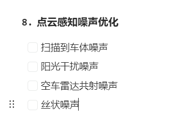
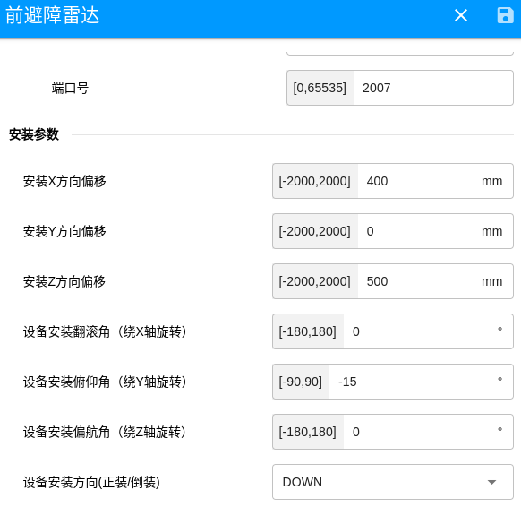

#### **噪点思路：**

| 引发因素         | 具体特点                                              |
| ---------------- | ----------------------------------------------------- |
| 自身传感器的问题 | 盲区“吸点”  多径噪声                                  |
| 环境因素         | 拖尾点 平行点  高反“鬼影”  高反“膨胀”  雨/雾/尾气噪声 |
| 干扰源           | 阳光干扰 对射干扰                                     |

斜着打的方案

#### **参考资料：**

1.[**代码实践\] 自动驾驶中常见的激光雷达点云去噪处理**](https://xiaotaoguo.com/p/pointcloud_noise_removal/)

2.**[自动驾驶激光雷达问题](https://zhuanlan.zhihu.com/p/493432029)**

3.**[激光雷达CustomMsg的Tag信息滤波](https://github.com/GCaptainNemo/LOAM-Preprocessing?tab=readme-ov-file)**

4.[**激光雷达小课堂 ｜ 如何使用 Livox 激光雷达点云中的 Tag 信息**](https://zhuanlan.zhihu.com/p/461364648)

5.**[PointCloudDeNoising](https://github.com/rheinzler/PointCloudDeNoising)**

6.**[激光slam 前端数据处理总结--过滤坏点](https://www.guyuehome.com/35391)**

**[经典：雪岭 · 激光雷达常见点云异常场景分析](https://mp.weixin.qq.com/s/Uc5lpdLQlYhLndK7XVEtFA)**
