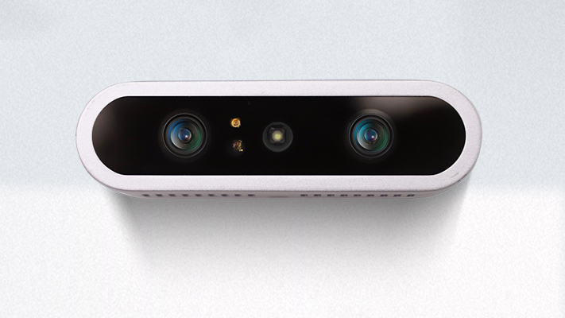
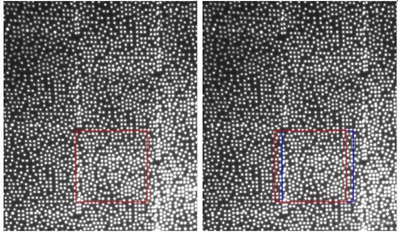
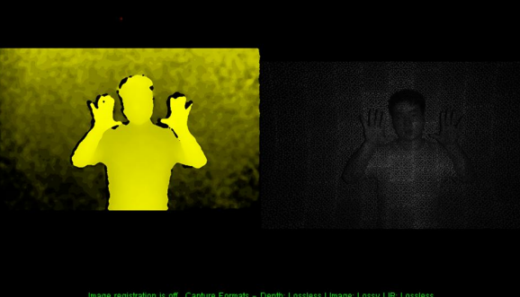
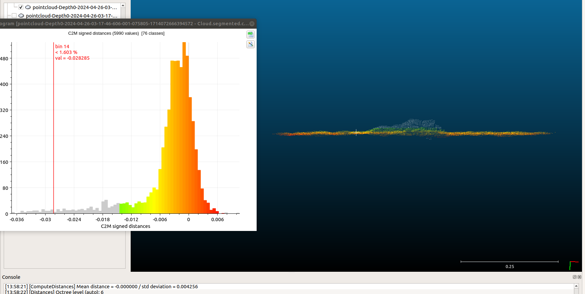
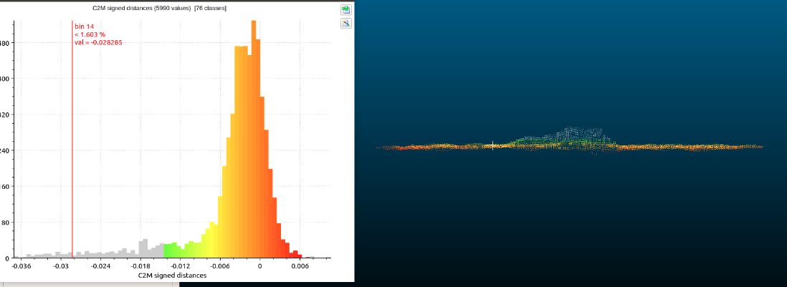
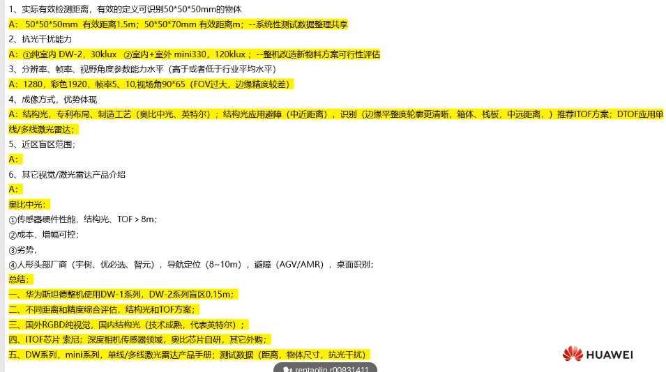

# 会议记录汇总

### **o车避障会议记录**(10.7)

* [ ] 货架腿滤除对和区域滤除对盲区的影响。

* [ ] 1.5 停止距离

* [ ] 减速距离；  abs+30(12盲区+20人脚)   限速区域取代减速  问题：动态避障问题。

* [ ] 窄通道的定义？宽度增量。

* [ ] 旋转中心：叉车（从动轮+舵轮）  O叉 （四个主动轮）

* [ ] 叉车：车体 托盘 货架 叉臂 门架：

* [ ] 业务：开关（传感器、功能）

* [ ] 后退场景：充电 、进库位、绕站、叉车取货、牵引车对接、路径设置；

* [ ] 墙边停车的原因分析？

* [ ] 悬空障碍物 1.识别悬空物体 2.反向计算盲区

* [ ] 同步旋转：货物和顶板同步 和车不一样  （顶板和托板区别）

* [ ] 多货架可以识别尺寸选择避障模型，多托盘不行，识别不了；

### **o车避障会议记录**(10.9)

* [ ] 案例：小车进入货架发生避障修改什么参数？

  1.小车动量宽度 2.相机检测高度 3.旋转增量

* [ ] 路径避障和动作避障；

* [ ] 手动控制避障方距离： 速度平方/2a+0.1m

* [ ] 案例：o叉混合

* [ ] 避障相机外壳安装

* [ ] 问题闭环链条：参数  业务  场景

### 避障系统2.0微重构启动会议纪要（9.28）

* [ ] 说明避障系统2.0升级背景，3.0升级为智能避障；
* [ ] 确定用车资源沟通及申请流程；
* [ ] 确定当前阶段不拆除货架腿检测及滤除，放在3.0系统；
* [ ] 讨论各模块工作量及时间安排；
* [ ] 梳理开发形式，

### 避障系统2.0 交互开发需求（10.11）

**问题统计**

* [ ] 多车配置参数配置一致性问题；
* [ ] 现场参数修改记录，权限开放问题；
* [ ] 车身避障点排查，标定问题可能导致部分点云在车体；
* [ ] 硬件掉线问题；

**现场原因排查**：

* [ ] 参数配置 ：避障模型 业务货物模型 场景模型参数 动作参数（待定...）
* [ ] 障碍物避障连接对应的来源传感器，不在基于车体；

**讨论项**：

* [ ] 多货架尺寸问题，讨论尺寸信息是否调度下发；
* [ ] 由于传感器误差大约15mm，预留一定增量空间？

**解决方案**：

* [ ] 从FAE的视角设置模型，按场景来分类，避免参数参数化设置；

* [ ] 离线(3D)和在线(2D)方式，地图依旧保留2D形式；

* [ ] 多场景配置和场景自定义；   ==测试反馈：非标场景不能开放到FAE；==

### 极动供应商产品介绍（10.26）

* [ ] 100klux 滤光片 芯片
* [ ] 信标 、玻璃
* [ ] itof
* [ ] 双频操作
* [ ] 周期问题
* [ ] 深度相机和rgb 偏移两个pixel的误差
* [ ] 最小尺寸3\*<3cm@2.2m>
* [ ] 噪点 飞点
* [ ] 多机对射    频率偏移   23组没问题

### 图漾供应商产品介绍（11.2）

* [ ] 两款产品，一款针对避障 240\*96 dtof ir 10wlux     rmb 1000   盲区：5cm

* [ ] 两款产品，一款针对感知 640\*480 dtof ir 没有rgb 10wlux  rmb 2000 16hz   FOV：90 70

* [ ] 未来、嘉腾、迈微接触

* [ ] 实测黑色效果还行，直角效果较好

* [ ] 滤波放在sdk

* [ ] 索尼的芯片;

* [ ] 自然光什么波段都有，如果是大工场，卤素灯基本不会受影响；

  

* [ ] 高反、低反、半反；

### 客户3D相机成像原理介绍（1.9）

### 华为项目出差（1.23）

* [ ] 取放货 io传感器安全防护 超高宽 挤压
* [ ] 海康的二维码定位
* [ ] 蓝芯的交互界面及传感器安装、静电链
* [ ] 充电桩 v型 3000
* [ ] 对接：  取放货、滚筒（反光板）、顶升
* [ ] 蓝芯潜伏车 5w   避障问题：铁链、货架腿底部返光
* [ ] slam定位精度+—10mm；

### 图漾叉尖传感器（1.26）

* [ ] 120° 60° 240\*96 无彩色相机
* [ ] 用于叉尖及栈板识别，料笼识别不成熟

### **19060 广州卡尔蔡司光学项目改造澄清会**（3.4）

10台

300ul

适配两个相机

现场版本：5.13.X

### 避障2.0后端测试结果汇总及前端的提测项（3.6）

1.避障模型和Matrix的显示没人维护（实际的模型切换和逻辑不一样);

2.手动控制避障还是原来一套逻辑；

3.凯哥代码还未合并；

### 海通-斯坦德，低矮障碍物检测讨论（3.11）

* [ ] 1cm  检测高度
* [ ] 过坎1cm
* [ ] 激光方案：比较窄停车 比较宽跨过
* [ ] 相机绕障距离  一般雷达绕障
* [ ] 相机方案？
* [ ] 超声波方案？锥面过大导致误避障
* [ ] 欧姆龙 前方避障方案：四个超声波雷法和激光雷法(嵌入车前体）

### 肇观3D相机（3.27）

* [ ] 近错点优化
* [ ] 室内外都有好的效果
* [ ] usb3.0容易掉线 海康10w小时稳定测试
* [ ] 航插目前能带3台
* [ ] usb接hub能否带挂8台相机?

后续...

* [ ] 对标DCW2
* [ ] 优势:多机hub稳定性, 室外深度成像
* [ ] 类似:精度(1.5%), 飞点,盲区40cm

### 刘文振面试问题（2025.3.27）

项目一
1.单目深度估计的距离是绝对的还是相对的，精度怎么样

2.深度法线模型在项目中是如何具体实现的？深度和法线的预测是分开进行的，还是通过一个联合模型完成的？在3D目标检测中，如何从深度和法线信息中提取目标的方向信息？是否有具体的后处理步骤？

项目二
1.自动泊车系统多视角感知，多相机标定是怎么标定的？
2.BEVformer模型结构
3.自动泊车系统对接成功率？自动泊车系统在实际场景中的表现如何？是否有遇到特殊情况（如狭窄空间、复杂环境）？如何解决？

项目三
1.静态障碍物检测模型，目标跟踪？

华为—奥比—std

1.gemini 室外 人型机器人 导航避障 星尘宇树

2.tof 芯片（索尼 三星 松下影像）国内做光学系统 模组 标定   （欧非舜宇歌尔微迈尔微视）
