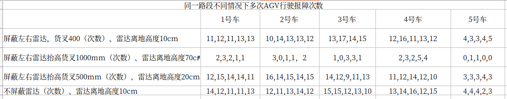
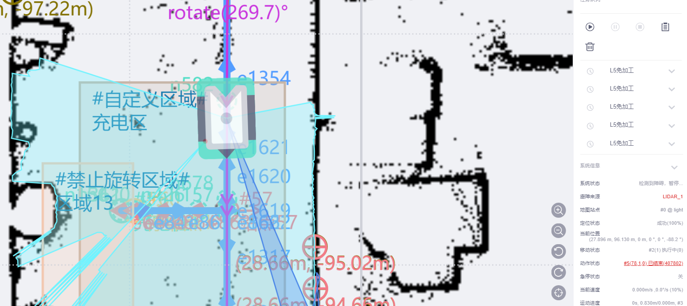
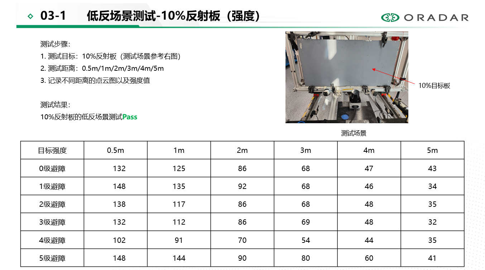
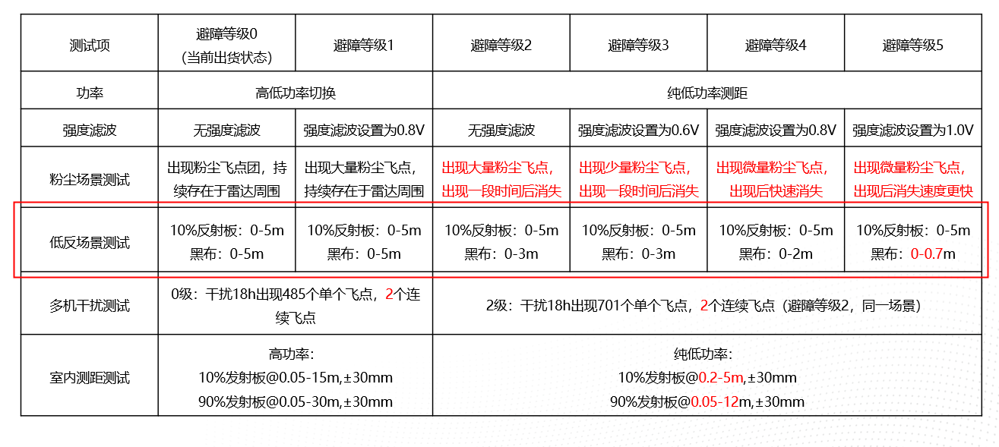
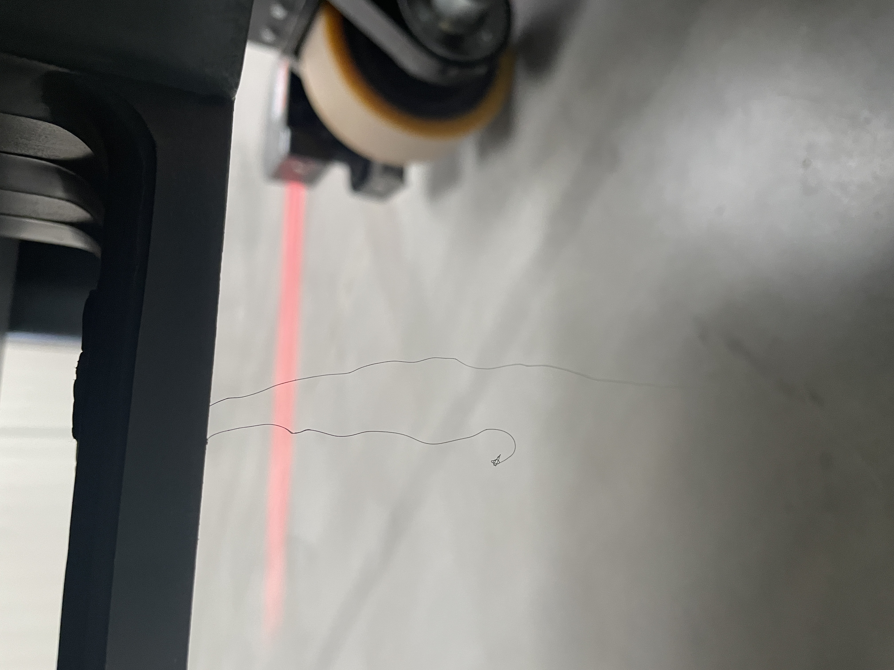
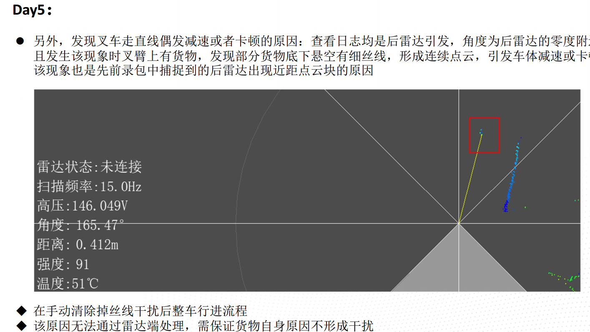
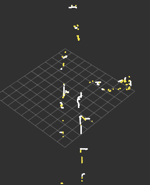
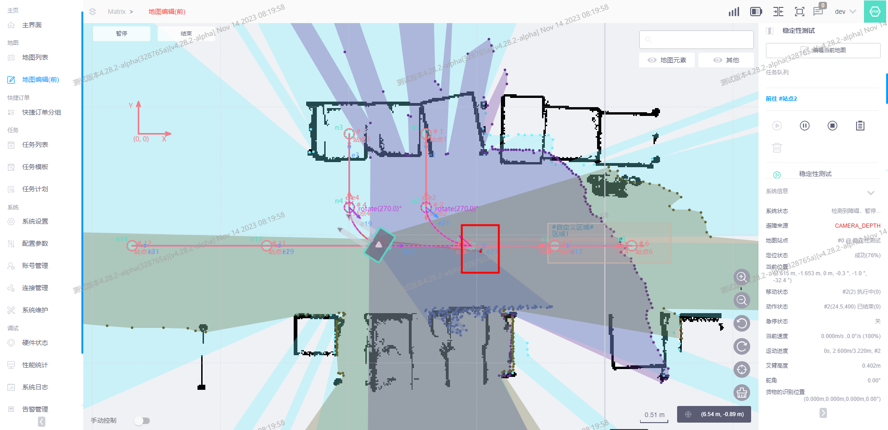
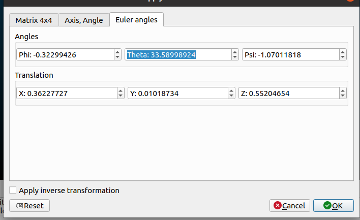
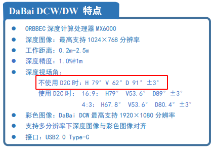

## 现场问题汇总及分析

#### 误避障（无中生有）检查清单

 1.避障参数是否正常配置；                                                                 

2.检查障碍物位置来源，及特征；                                                点状、团状

3.被检测物反射率性质；

4.排查自身：供应商的避障等级（是否滤波）

5.排查环境：多机共射 、工厂光源

#### 未避障（有中生无）检查清单

 1.避障参数是否正常配置；    

2.待补充...

#### 1.**比亚迪偶发避障问题**

- oradar 1512  mian 2505  sick 240
- 

- 555 原始代码加log
- 444 只开启 后避障雷达的cluster
- 关闭后避障雷达 机器重连

**FAE&&研发联调过程：**

- 工厂环境下跑图，后侧ORADAR避障雷达误触发较多，且呈现在==**特定区域的叉臂区域附近**==；

- 遮挡左右侧SICK雷达，仅测试后侧ORADAR，触发误触发较多，排除其他雷达频段干扰；

- 添加聚类滤波算法，未见明显改善，偶发的杂点并==**不完全是孤立点**==；

- 调高叉臂到1m, 同时用白色泡沫遮挡上下叉臂，==**误触发频率减少**==。

  ​             

**测试总结：**

- 结合工厂强光环境下，且地面是金属等高反材质，比较容易形成==**多次反射干扰**==雷达；
- 干扰源呈偶发、集聚特点；

**解决思路：**

- 数据端：联系供应商针对强光高反环境下的是否有相应优化，可配合调整传感器参数及更新SDK；
- 算法端：根据测试经验，滤掉整个叉臂附近区域，是否会对取放货等任务有影响还需进一步评估；
- 业务端：前进过程可以暂时关闭后侧避障功能；
- 产品端：同时用三个SICK, 替换后侧ORADAR避障雷达。

#### 2.**芜湖中电偶发避障问题**

#61312 【芜湖中达电子1期】2号车行驶时误报障碍
https://ones.standard-robots.com:10120/project/#/team/UNrQ5Ny5/task/JzgaQh7JZVtrtnOD

本质：召回率和准确率的问题

> **解决办法**：降低功率
>
> **原因分析：**杂点在车体的右前方，粉尘较多且如果功率过大是非常敏感的；
>
> **可能引出的问题：**对黑色物体检测距离降低，盲区增大(对10%的低反物体)

#### 3.蔚来现场化纤丝状物问题

- 添加了3601、3602两个参数，分别是后避障雷达和两侧避障雷达过滤连续点数，默认为5，化纤丝场景酌情调整至15附近，过大会导致检测小尺寸物体减弱；
- 其他场景建议通过3600参数关掉此功能；
- 回归测试版本：4.33.0
- 本地离线仿真测测试具备过滤效果；

#### 4.办公一楼日本叉车拐弯处误避障

【SROS V4.28.2】【KIOXIA】车辆转弯时空间避障相机经常误避障

-0.999739 ; -0.022854 ; 0.000000

pitch:33.6   (平面标定) 

pitch:35   roll:-1.5   目前最好

pitch:32.8（(默认)   roll:0   左侧一米附近必现

测试排查：
1.拐弯时候避障模型会包含点云边界出误差较大的点云，经加入xy两方向的非线性矫正抑制后（下压地面点云），依旧在拐弯时的左侧误避障；
2.离线录包分析，地面点云存在左高右低的情况，调整roll为-2°后，右侧偶发避障；
3.通过再次分析点云，在cloudcompare工具标定新的pitch，yaw后解决误避障问题；

原因定位：目前老版本手工标定的方式过于简陋，后续感知会出一版新标定流程文档；

问题解决： 修改标定参数：yaw = -1.5° roll = 35°

#### CPU占用太高需下采样对检测能力的影响分析

视野FOV：80 * 62

深度图图分辨率ppi： 640 * 400

横向方向上1°可被640/80≈8个像素检测到

假如以最远的2m检测距离为例:  2m*(sin1°)/8 ≈2 * 0.017m/8 ≈  3.4cm/8 = 4.25mm 

即最小检测尺寸：4mm@2m

总结：根据产品定义，在工作距离内需检测5cm的物体，根据计算，即使图像分辨率1/4的情况，检测能力还能满足这个条件;

-16.6

#### *.其他小问题汇总

\#62735 【SRP V5.9.1】【Gulf】深度避障相机避障功能开启后无效
https://ones.standard-robots.com:10120/project/#/team/UNrQ5Ny5/task/CZGNAYGgtPiHI535

解决：配置参数实际没有打开避障相机

\#62757 【SRP V5.9.1】【必现】【空间避障】修改499参数不生效，用的是机械高度
https://ones.standard-robots.com:10120/project/#/team/UNrQ5Ny5/task/56pZcdYH5aaGWmCg

解决：按设计，修改避障模型高度应该改 nav.vehicle_height 而车体高度 chassis.body.vehicle_height 是不变的属性，不可更改. 查了代码，空间避障相机相关的代码中错误地获取了机械高度。

#### **成因分析总结**

