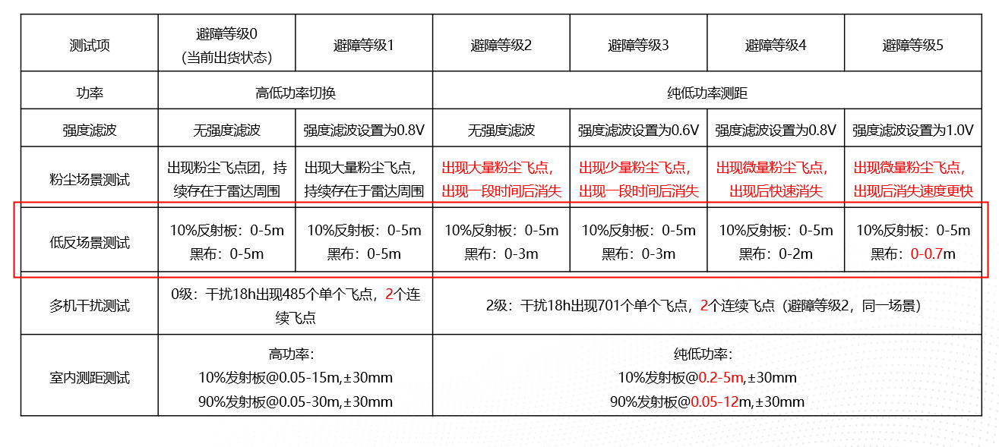

## 现场问题汇总及分析

#### 误避障（无中生有）检查清单

1.避障参数是否正常配置；

2.检查障碍物位置来源，及特征；                                                点状、团状

3.被检测物反射率性质；

4.排查自身：供应商的避障等级（是否滤波）

5.排查环境：多机共射 、工厂光源

#### 未避障（有中生无）检查清单

1.避障参数是 否正常配置； 

2.待补充...

#### 1.**比亚迪偶发避障问题**

* oradar 1512  mian 2505  sick 240

* 

* 555 原始代码加log

* 444 只开启 后避障雷达的cluster

* 关闭后避障雷达 机器重连

**FAE&&研发联调过程**：

* 工厂环境下跑图，后侧ORADAR避障雷达误触发较多，且呈现在==**特定区域的叉臂区域附近**==；

* 遮挡左右侧SICK雷达，仅测试后侧ORADAR，触发误触发较多，排除其他雷达频段干扰；

* 添加聚类滤波算法，未见明显改善，偶发的杂点并==**不完全是孤立点**==；

* 调高叉臂到1m, 同时用白色泡沫遮挡上下叉臂，==**误触发频率减少**==。

**测试总结**：

* 结合工厂强光环境下，且地面是金属等高反材质，比较容易形成==**多次反射干扰**==雷达；
* 干扰源呈偶发、集聚特点；

**解决思路**：

* 数据端：联系供应商针对强光高反环境下的是否有相应优化，可配合调整传感器参数及更新SDK；
* 算法端：根据测试经验，滤掉整个叉臂附近区域，是否会对取放货等任务有影响还需进一步评估；
* 业务端：前进过程可以暂时关闭后侧避障功能；
* 产品端：同时用三个SICK, 替换后侧ORADAR避障雷达。

#### 2.**芜湖中电偶发避障问题**

\#61312 【芜湖中达电子1期】2号车行驶时误报障碍
<https://ones.standard-robots.com:10120/project/#/team/UNrQ5Ny5/task/JzgaQh7JZVtrtnOD>

本质：召回率和准确率的问题

> **解决办法**：降低功率
>
> \*\*原因分析：\*\*杂点在车体的右前方，粉尘较多且如果功率过大是非常敏感的；
>
> \*\*可能引出的问题：\*\*对黑色物体检测距离降低，盲区增大(对10%的低反物体)

#### 3.蔚来现场化纤丝状物问题

* 添加了3601、3602两个参数，分别是后避障雷达和两侧避障雷达过滤连续点数，默认为5，化纤丝场景酌情调整至15附近，过大会导致检测小尺寸物体减弱；
* 其他场景建议通过3600参数关掉此功能；
* 回归测试版本：4.33.0
* 本地离线仿真测测试具备过滤效果；
  

#### 4.办公一楼日本叉车拐弯处误避障

【SROS V4.28.2】【KIOXIA】车辆转弯时空间避障相机经常误避障

\-0.999739 ; -0.022854 ; 0.000000

pitch:33.6   (平面标定)

pitch:35   roll:-1.5   目前最好

pitch:32.8（(默认)   roll:0   左侧一米附近必现

测试排查：
1.拐弯时候避障模型会包含点云边界出误差较大的点云，经加入xy两方向的非线性矫正抑制后（下压地面点云），依旧在拐弯时的左侧误避障；
2.离线录包分析，地面点云存在左高右低的情况，调整roll为-2°后，右侧偶发避障；
3.通过再次分析点云，在cloudcompare工具标定新的pitch，yaw后解决误避障问题；

原因定位：目前老版本手工标定的方式过于简陋，后续感知会出一版新标定流程文档；

问题解决： 修改标定参数：yaw = -1.5° roll = 35°

#### 5.标定导致的误避障问题(昆山标定+眉山工厂阳光导致)

\==**标的相关前置概念**:==

* 坐标系的变换和点在一个坐标下的变换的区别
* 600E相机安装抬头(仰角)为负角度
* 结论:调==高角度(即抬高相机==)↑ 带来==小障碍物的检测能力==提升↑同时提==高误避障率==↑

#### 6.江门中航锂电撞车分析

**1.碰撞现场回溯**

​	根据现场反馈,MD20车型9号车运行时与通道里面停在停靠点的车辆4号车(静止)尾部发生碰撞,四号车叉臂高度400mm, 在碰撞过程中有减速动作,深度相机一直未检测到在停止距离内的叉臂;

**2.上位机点云测试**

​	相机接入大白上位机,深度图和点云图都能清楚识别到点云,排除相机数据源的问题;

**3.排查叉臂检测高度**

​	更新固件为相机常开版本,方便调试过程Matrix显示障碍物点云, 布置现场,使叉臂在深度相机正前方500mm附近, 调高叉臂到600mm,发现叉臂点云,但只能看到叉尖前沿部分的点云;

**4.通过录取sros录包功能和静态点云分析**

​	sros获取到驱动点云,点云处理后已发出数据,通过保存的静态点云分析, 驱动原始点云能看叉臂,通过拟合叉臂,发现有10°的倾斜,和标定参数给的pitch角28°不匹配;

**4.确认现场安装方式**

与结构那边确认,目前MD20有3个安装孔位,现场安装到中间的孔位,导致实际安装和配置参数不一致;

#### 7.CPU占用太高需下采样对检测能力的影响分析

视野FOV：80 \* 62

深度图图分辨率ppi： 640 \* 400

横向方向上1°可被640/80≈8个像素检测到

假如以最远的2m检测距离为例:  2m\*(sin1°)/8 ≈2 \* 0.017m/8 ≈  3.4cm/8 = 4.25mm

即最小检测尺寸：4mm\@2m

总结：根据产品定义，在工作距离内需检测5cm的物体，根据计算，即使图像分辨率1/4的情况，检测能力还能满足这个条件;

\[此链接]\(<https://crxmouse.com/the-mouse-chase-2)-16.6>

#### \*.其他小问题汇总

\#62735 【SRP V5.9.1】【Gulf】深度避障相机避障功能开启后无效
<https://ones.standard-robots.com:10120/project/#/team/UNrQ5Ny5/task/CZGNAYGgtPiHI535>

解决：配置参数实际没有打开避障相机

\#62757 【SRP V5.9.1】【必现】【空间避障】修改499参数不生效，用的是机械高度
<https://ones.standard-robots.com:10120/project/#/team/UNrQ5Ny5/task/56pZcdYH5aaGWmCg>

解决：按设计，修改避障模型高度应该改 nav.vehicle\_height 而车体高度 chassis.body.vehicle\_height 是不变的属性，不可更改. 查了代码，空间避障相机相关的代码中错误地获取了机械高度。

#### 8.花篮跌落问题排查

和确认现场发生事故时间为5.28-20.21分，花篮跌落被深度相机检测到，离跌落最近的一次减速MANUAL_RUNNING => MANUAL_RUNNING_SLOW检测时间为

离跌落最近的一次停止动作为

在跌落之前1个小时以内没发现有障碍物在落在停止区导致的急停问题

#### 9.昆山现场左右两侧竖装方案 

 90  -110

10.雷达打到镜面反光导致误避障（类似mid360进入金属货架）

