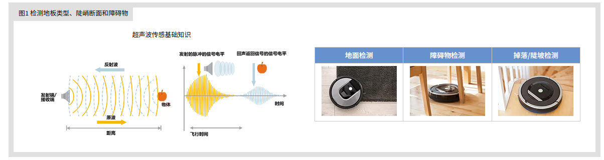

#### 机器人感知方案调研

[**超声波识别材质**](https://product.tdk.com.cn/zh/techlibrary/applicationnote/how-service-robots-make-sense.html)

当扫地机器人从木地板区域移动到铺有地毯的区域时，传感器可以发出指令让电机加速，因为在地毯上的移动阻力更大，需要更强的驱动力。此外，这些传感器还能检测到扫地机器人是否已移动到楼梯边缘，避免摔落。

[**【Lidar】Lidar激光雷达一篇全（两万字激光雷达详细介绍）**](https://blog.csdn.net/qq_34972053/article/details/136718378?spm=1001.2101.3001.6650.4&utm_medium=distribute.pc_relevant.none-task-blog-2%7Edefault%7EBlogOpenSearchComplete%7ERate-4-136718378-blog-134874450.235%5Ev43%5Epc_blog_bottom_relevance_base9&depth_1-utm_source=distribute.pc_relevant.none-task-blog-2%7Edefault%7EBlogOpenSearchComplete%7ERate-4-136718378-blog-134874450.235%5Ev43%5Epc_blog_bottom_relevance_base9&utm_relevant_index=3)