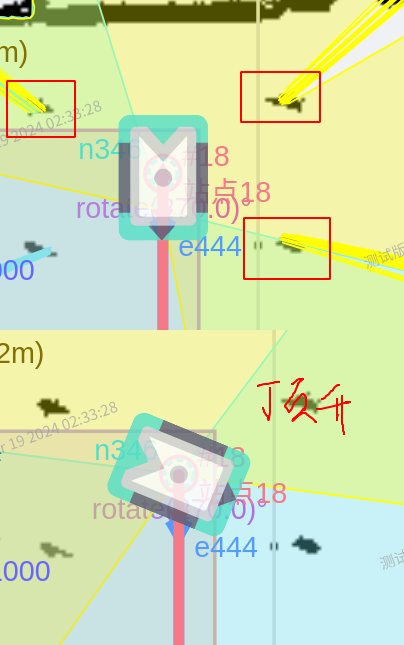

## O车货腿过滤

#### 过滤流程:

1. **初始化:**

- 读取货架组信息

  ```c++
      rack_infos_.clear();
      createRackInfos(rack_infos_);
  ```

- 根据use_region_filter判断区域滤波还是货架腿滤波

  ```c++
  if (rack_para_.use_region_filter) {
  lidar_info->rack_filter.reset(new rack::RackFilter<sros::core::LaserScan_ptr>(para));
  } else {
  lidar_info->rack_filter.reset(
  new rack::RackLegsFilter<sros::core::LaserScan_ptr>(para));
  }
  ```

- 如果有货架组信息,调用货架检测器**(需要货架组来初始化)**

  ```c++
  rack_detector_.reset(new rack::RackDetector<sros::core::LaserScan_ptr>(para, rack_infos_));
  ```

- 货架滤波器计算(得到circle信息用于后续滤除)

  ```c
  rack::RackPara rack_para_1;
  rack_para_1.rack_length = rack_para_.rack_leg_center_length;
  rack_para_1.rack_width = rack_para_.rack_leg_center_width;
  rack_para_1.rack_leg_diameter = rack_para_.rack_leg_diameter;
  lidar_info->rack_filter->computeRackInfo(rack_para_1);
  ```
2. **循环读点云:**

- 
  开启设备读取主雷达的数据,重新计算recomputeRackInfo(实际内部调用computeRackInfo)

  ```c
  // rack filter
  if (laser_module_info->is_main_lidar) {
  recomputeRackInfo(laser_scan);
  }
  
  //识别货架组后识别到目标货架写入到参数表
  void recomputeRackInfo(sros::core::LaserScan_ptr &laser_scan, bool use_region_filter) {
  double rotate = (double)g_state.rotate_value / 1000.0;
  if (rack_detector_) {
  rack::RackInfo_Ptr rack_para;
  if (rack_detector_->detectRack(laser_scan, rack_para, rotate)) {
  if (rack_para) {
  LOG(INFO) << "begin to set!";
  auto &s = sros::core::Settings::getInstance();
  s.setValue<float>("rack.max_contour_length",
  rack_para->avd_oba_length * 1000.0);
  s.setValue<float>("rack.max_contour_width", rack_para->avd_oba_width * 1000.0);
  s.setValue<float>("rack.rack_leg_diameter", rack_para->leg_d * 1000.0);
  if (!rack_para->leg_groups.empty()) {
  s.setValue<float>("rack.rack_leg_center_length",
  rack_para->leg_groups.front().length * 1000);
  s.setValue<float>("rack.rack_leg_center_width",
  rack_para->leg_groups.front().width * 1000);
  }
  
  if (use_region_filter) {
  rack_region_filter->computeRackInfo(rack_para->rack_para);
  } else {
  rack_legs_filter->computeRackInfo(rack_para->rack_para);
  }
  
  LOG(INFO) << "successfully to set!";
  } else {
  LOG(INFO) << "err to detect rack!";
  }
  
  } else {
  LOG_EVERY_N(INFO, 20) << "err to detect rack!";
  }
  }
  }
  
  ```
  
- 开启滤出功能

  ```
  if (enable_remove_rack_leg_ &&(!enable_filter_only_load_full_ ||g_state.load_state ==sros::core::LOAD_FULL)) {  // TODO(nobody):
  // 这里需要修改，当前处理方式容易出现无法检测出货架尺寸而避障
  double rotate = (double)g_state.rotate_value / 1000.0;
  laser_module_info->rack_filter->filterRack(laser_scan, rotate);
  }
  ```

  


#### 优化点:

- [ ] 雷达和相机解耦,针对接驳台这种没有货架的场景;用这rack.enable_load_rack代替   背负

 

#### 前置内容:

- 从代码逻辑上看,货架腿检测和货架组有关,如果没有配置货架信息,则不会初始化detector;
- 货架滤除只需要中心长宽,不需要避障长宽;




# 多货架数据协议

## 1. 数据结构  

### `rack` 货架信息  

| 参数                     | 描述           | 数值 | 单位 | 类型    | 取值范围（如适用） |
| ------------------------ | -------------- | ---- | ---- | ------- | ------------------ |
| `rack_leg_center_length` | 货架腿中心长度 | 1060 | mm   | integer | -                  |
| `rack_leg_center_width`  | 货架腿中心宽度 | 600  | mm   | integer | -                  |
| `rack_leg_diameter`      | 货架腿直径     | 100  | mm   | integer | -                  |
| `max_contour_length`     | 货架长度       | 1200 | mm   | integer | `[0, 2500]`        |
| `max_contour_width`      | 货架宽度       | 600  | mm   | integer | `[0, 2500]`        |


## 2. JSON 数据格式示例  

```json
{
  "rack": {
    "rack_leg_center_length": {
      "description": "货架腿中心长度",
      "value": 1060,
      "unit": "mm",
      "type": "integer"
    },
    "rack_leg_center_width": {
      "description": "货架腿中心宽度",
      "value": 600,
      "unit": "mm",
      "type": "integer"
    },
    "rack_leg_diameter": {
      "description": "货架腿直径",
      "value": 100,
      "unit": "mm",
      "type": "integer"
    },
    "max_contour_length": {
      "description": "货架长度",
      "value": 1200,
      "unit": "mm",
      "type": "integer",
      "range": [0, 2500]
    },
    "max_contour_width": {
      "description": "货架宽度",
      "value": 600,
      "unit": "mm",
      "type": "integer",
      "range": [0, 2500]
    }
  }
}
```

