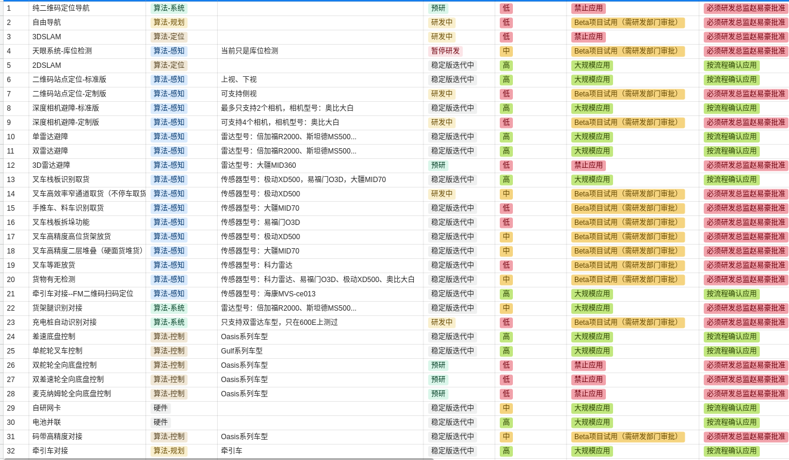
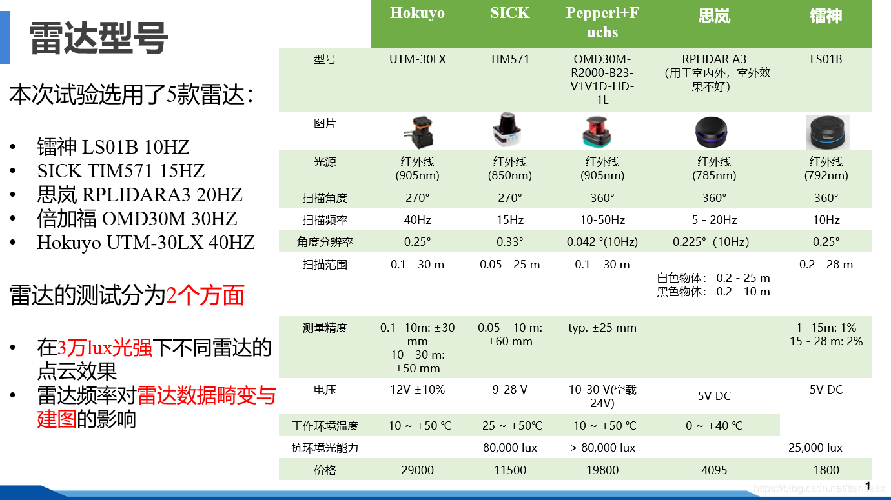
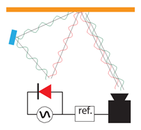
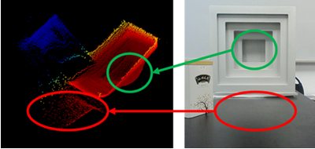
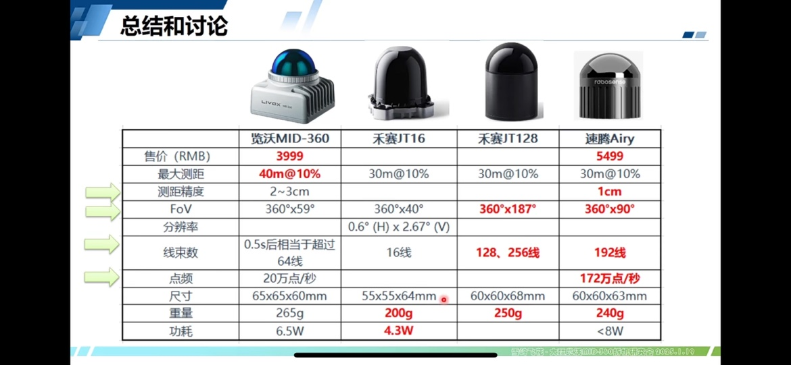

[LEIMOU    镭眸](http://www.leimou.com/)

[HINSON](http://isite.baidu.com/site/hinson-xs.com/9dd6ee48-f954-4111-9908-454add2726cd?ch=48http://isite.baidu.com/site/hinson-xs.com/9dd6ee48-f954-4111-9908-454add2726cd?ch=48\&wid=62ba4baafa6e4690b5cdd5d24190d37f_0_0\&wid=62ba4baafa6e4690b5cdd5d24190d37f_0_0)    

[BLUESEA](https://aisite.wejianzhan.com/site/wjz3p8iw/c1eaa7b2-4ae7-4220-873e-db007e54311a?ch=48)

奥锐达雷达MS200  ORADAR\_MS200  serial port: /dev/ttyACM0  baud rate: 230400

奥锐达雷达MS500  ORADAR\_ORBB   ip: 192.168.71.201, udp port: 6060/2007

星秒激光雷达     SIMINICS      ip: 192.168.71.100, tcp port: 2368

因泰立雷达避障   LEIMOU        ip: 192.168.71.201, tcp port: 2007

科力安全激光雷达  KELI         ip: 192.168.71.100, udp port: 2112

蓝海雷达         BLUESEA     ip: 192.168.71.200  udp port: 6543/6668

兴颂雷达         HINSON      ip: 192.168.71.100  udp port: 8080   <https://standard-robots.yuque.com/group-rd/ktockm/akvq0k4tzcm3yxt0#et57>

[定位雷达传感器对比](https://blog.csdn.net/tiancailx/article/details/110141867)

#### [解密多径干扰：ToF相机面临的最大挑战与解决之道](https://zhuanlan.zhihu.com/p/645861136)

#### 光鉴传感器：

 **Nebula400资料包：** https://drive.weixin.qq.com/s?k=ANUA-wdkABAq0HKHjZ 

规格书： [Deptrum_Nebula401_规格书_v0.3.pdf](../../.topwrite/assets/Deptrum_Nebula401_规格书_v0.3.pdf) 
