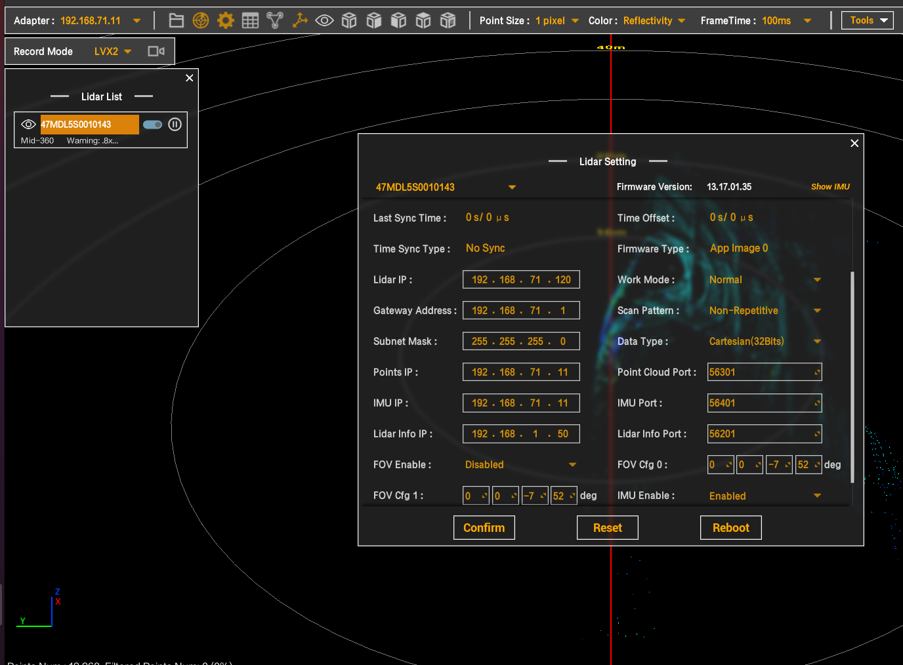
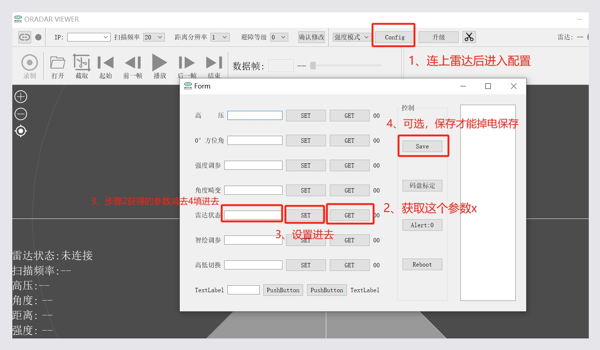
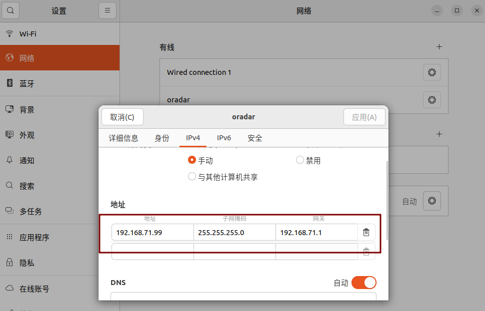
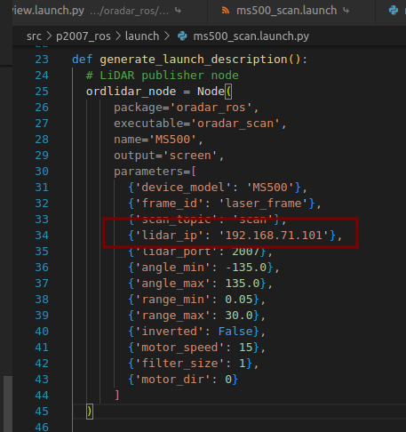

##  传感器上位机配置和ros配置汇总


### MID360使用说明（网口）

> livox的mid360目前部署在小车是通过交换机连接的，获取原始数据方式有以下三种方式：
>
> 1.通过官方的Livox Viewer2可视化工具获取数据；
>
> 2.通过安装Livox-SDK2的ros驱动来获取数据；
>
> 3.通过订阅的方式获取集成到SROS平台里面的驱动数据；


#### 0.前置工作

 确保上位机/ROS驱动置于和雷达IP同一局域网下

修改主机地址

```
sudo ifconfig
sudo ifconfig enp2s0 192.168.1.50 //将enp6s0换成雷达和电脑的以太网有线连接的名称
```

或者在设置中修改以太网ip


#### 1.Livox Viewer2使用方式

- [**Livox Viewer2下载链接**](https://www.livoxtech.com/downloads)
- 正确连接雷达硬件并完成IP配置后运行指令`./livox viewer.sh`启动Livox Viewer2
- IP配好后会刷新Lidar List
- 通过界面设置可以查询到Lidar IP




#### 2.Livox-SDK2使用方法

- **安装Livox-SDK2:**

```shell
git clone https://github.com/Livox-SDK/Livox-SDK2.git
cd ./Livox-SDK2/
mkdir build
cd build
cmake .. && make -j8
sudo make install
```

- **安装livox_ros_driver2:**

```shell
git clone https://github.com/Livox-SDK/livox_ros_driver2.git ws_livox/src/livox_ros_driver2
cd ws_livox
source /opt/ros/noetic/setup.sh
./build.sh ROS1
```

- 更改livox_ros_driver2/config/MID360_config.json文件内参数


#### 3.SROS集成Livox-SDK2使用方法


### Oradar ms500使用说明（网口）

1.std固件协议不是标准的，需要上位机修改雷达状态



2.配置本机pc手动网络配置如下

 

std的雷达的网段不是默认雷达IP为192.168.1.100，而是


