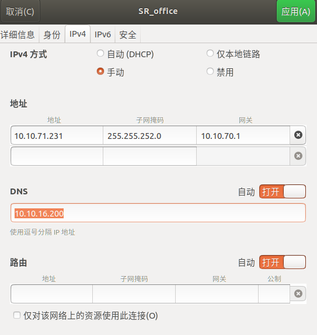

# 避障问题汇总

#### **开发调试常用**

```shell
ls -l /sros/bin/sros     #  查看sros可执行程序
/sros/bin/sros --version # 查看sros版本

systemctl status sros  # 查看sros运行状态
systemctl stop sros    # 停止sros程序运行
systemctl start sros   # 启动sros程序运行
systemctl status ui_server # 查看Matrix运行状态
systemctl stop ui_server   # 停止Matrix程序运行
systemctl start ui_server  # 启动Matrix程序运行
# 改软链接
当Matrix不能升级，手动升级方法
在电脑打开终端，scp命令传输升级包到控制器
在控制器系统终端，把升级包文件复制到/sros/update/sros-1.tar.gz
#如果机器崩了 用备份的固件过渡
cp -rd /sros/backup/upgrade/sros/6ce47541154065b3260c24bbc6716cca.latest  /sros/update/sros-1.tar.gz
systemctl restart sros  # startup.sh脚本会执行升级

telnet <ip> <port> 可以查看sros提供给matrix的socket连接的端口是否连通，类似可以看 5002，80，8088， 443端口

p -P 2222 sros root@10.10.91.4:/sros/bin/
sshpass -p SRpasswd@2017 ssh  -p 2222 root@10.10.91.4

git checkout 399c6190c6315df6bfbcb8aaed52d006e096f2f9 modules/obstacle/sensor_manager/sensor_process_alg.cpp
git checkout  -- modules/obstacle/sensor_manager/sensor_process_alg.cpp

cat /sros/log/sros.INFO | grep "card_detection.cpp:491] {task}    goal in agv world pose:" > /sros/debug_data/test.txt
cd /d d:   

gdb

######ssh 免密登录
1.复制自己的公钥 cat ~/.ssh/id_rsa.pub
ssh-rsa AAAAB3NzaC1yc2EAAAADAQABAAABAQC/xIqlWZxUlKrkIrEHZY6YeMS14JYjPMVDyLvyzmjQFt8HtTTbe0KcsTrkUSlyZt4e/GAgDiRfZBU2lTRvbbD/wSwoPUuooHJjWL7wQpBeVsLMG4QXEWrCRUV1aLo68nfyVFMieEtlUE2gWIu+xGZ7JHDGX6JZAAeVtNE87jzA3GtIN8V6Wu3hk13XYH81eF6XV+F250V8WOjUIRpiN2u0pqCBc5fKLFw+KYJvvi4X8dExEB8BrlrHOmB+7/OFx85yHppNYtYLQpX/oZFsHLF9RqcAE6SrtHlJ/6C9sB46nwzRPaoSm75qMKBFWqALwB+Oq9T6yMgbXMOpBnqaTDET 1135459126@qq.com
2.再目标机器的.ssh文件夹建立授权文件粘贴
touch authorized_keys
echo "ssh-rsa AAAAB3NzaC1yc2EAAAADAQABAAABAQC/xIqlWZxUlKrkIrEHZY6YeMS14JYjPMVDyLvyzmjQFt8HtTTbe0KcsTrkUSlyZt4e/GAgDiRfZBU2lTRvbbD/wSwoPUuooHJjWL7wQpBeVsLMG4QXEWrCRUV1aLo68nfyVFMieEtlUE2gWIu+xGZ7JHDGX6JZAAeVtNE87jzA3GtIN8V6Wu3hk13XYH81eF6XV+F250V8WOjUIRpiN2u0pqCBc5fKLFw+KYJvvi4X8dExEB8BrlrHOmB+7/OFx85yHppNYtYLQpX/oZFsHLF9RqcAE6SrtHlJ/6C9sB46nwzRPaoSm75qMKBFWqALwB+Oq9T6yMgbXMOpBnqaTDET 1135459126@qq.com" >> ~/.ssh/authorized_keys


watch -n 0.1 ls -htal   实时监控文件变化情况
vi /usr/lib/OpenNI2/Drivers/orbbec.ini  奥比驱动参数调整

#VPN 后台运行
nohup ./cfw & disown
ip:10.10.71.231
子网：255.255.252.0
网关：10.10.70.1
dns：10.10.16.200

#避障调试技巧
tail -f /sros/log/sros.INFO |grep "coord"
cat  /sros/log/sros.INFO |grep rack |head -n 100
cat /sros/log/sros.INFO | grep "car_size\|rota\|com"
ln -sf sros_a3be7aa-nxp sros # 示例，改sros软链接
journalctl -f  # 查看实时日志 #只能查看报错信息

#读取最新生成的固件到到/sros/updata

tail -f /sros/log/sros.INFO  # 终端查看 sros 实时日志
cat sros+\(3\).INFO..info|grep -B 5 "cpp:101"
MANUAL_RUNNING => MANUAL_PAUSED   //急停现象查看
task 1086    //根据移动任务来查
//根据任务结束来查找当前状态
main_module.cpp:951] Path 彻底结束，目标站点1225 当前位置：Pose(-0.513062, -63.1912, 0, 0.00788541, 0.000463157, 3.12432)


#查看崩溃日志
gdb /sros/bin/sros /sros/log/core-sros-1604006748.142550 # 示例， GDB查看崩溃点 敲bt等
./scripts/format.py -t release_5.33.x
```


**#Linux的常见实用命令**

```shell
#查看有没有某个库的方法
ls /usr/include/boost
find -name "*glog.so"    #find -name *glog.so是不起效的
ls /usr/include/opencv4
ls /usr/lib | grep opencv
find -ctime -2   find -cmin -2    #2分钟创建文件的时间 按分钟
find -mtime -2   find -mmin -2       #2天创建文件的时间 按小时    实际测试都一样
```


| 方法                | 命令或工具                            | 功能描述                                                                 |
|---------------------|---------------------------------------|--------------------------------------------------------------------------|
| `ldd`              | `ldd <binary>`                       | 查看二进制文件所依赖的动态链接库及其路径和加载地址。                     |
| `readelf`          | `readelf -d <binary>`                | 查看 ELF 文




#### Matrix使用汇总:

- [ ] 避障红点只显示停止区域点;

- [ ] 避障区域注意宽度增量;

- [ ] 旋转增量会扩大避障长宽;

- [ ] 避障模型高度 =  车体+上装+抬升+ 自定义增量


### SROS系统理解

- 参数设置功能深度理解
- 地图管理功能
- 动作(对接-执行)
- 系统状态(各个模块状态机)


### 储备数据

* [ ] angle\_increment......0.00311666

* [ ] 大白避障相机 640\*480 30万个点     实际256000   640 \* 400  sin(1°) 的值约为 0.01745240643728351

  

避障相机的性能指标评估\*\*（小障碍检测）\*\*

* [ ] 静态天赋：安装高度、pitch
* [ ] 动态天赋：车速


产品相关

| 型号    | 安装角度(**==传感器相对于车体==**) |      |
| ------- | ---------------------------------- | ---- |
| 600E    | -16°                               |      |
| 300UL   | -32°                               |      |
| 300E    | -18.3349°                          |      |
| 华为O车 | -25                                |      |


确定以下几个问题:

1.自定义区域车体长宽用的是nav.vehicle_width 还是chassis.body.vehicle_width?设置值是多少

2.小车对角线的一半到墙体还有多远?

3.扫到墙体是不是避障红点没在壁纸模型以内?


#### 系统问题汇总（必现）

- [ ] [ROS2使用zsh无法用tab补全 ros2 指令](https://blog.csdn.net/qq_24649627/article/details/131207830?spm=1001.2101.3001.6650.3&utm_medium=distribute.pc_relevant.none-task-blog-2%7Edefault%7EBlogCommendFromBaidu%7ERate-3-131207830-blog-132456374.235%5Ev43%5Epc_blog_bottom_relevance_base9&depth_1-utm_source=distribute.pc_relevant.none-task-blog-2%7Edefault%7EBlogCommendFromBaidu%7ERate-3-131207830-blog-132456374.235%5Ev43%5Epc_blog_bottom_relevance_base9&utm_relevant_index=6)
