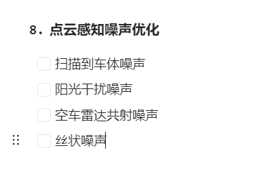
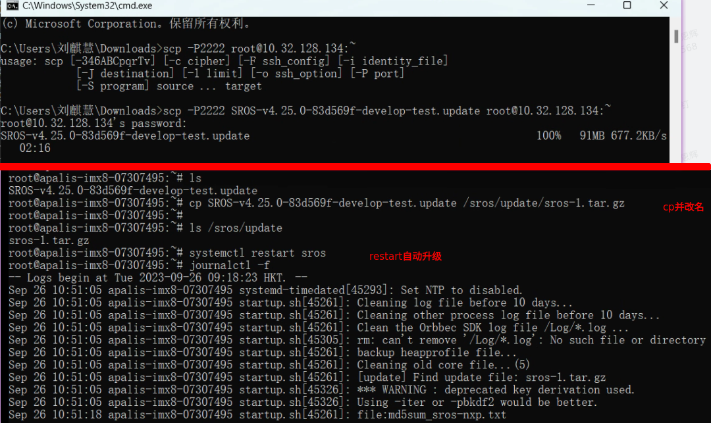
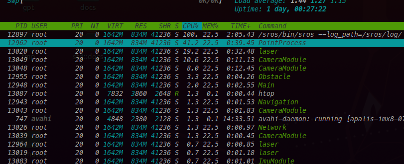

# 避障问题汇总

**现场反馈实际问题 成因分析**


#### **开发调试常用**

```shell
ls -l /sros/bin/sros     #  查看sros可执行程序
/sros/bin/sros --version # 查看sros版本

systemctl status sros  # 查看sros运行状态
systemctl stop sros    # 停止sros程序运行

# 改软链接
cd /sros/bin/
ls -lrt
./sros_a3be7aa-nxp  --version  # 示例，查看每一个sros文件，找出好用的历史版本
ln -sf sros_a3be7aa-nxp sros # 示例，改sros软链接

systemctl start sros   # 启动sros程序运行

systemctl status ui_server # 查看Matrix运行状态
systemctl stop ui_server   # 停止Matrix程序运行
systemctl start ui_server  # 启动Matrix程序运行

journalctl -f  # 查看实时日志

# V5.7.0 及以上版本，终端查看实时日志的方式变了
tail -f /sros/log/sros.INFO  # 终端查看 sros 实时日志

journalctl -f  #只能查看报错信息

ls -l /sros/log/core*   # 查看崩溃日志
gdb /sros/bin/sros /sros/log/core-sros-1604006748.142550 # 示例， GDB查看崩溃点 敲bt等

当Matrix不能升级，手动升级方法
在电脑打开终端，scp命令传输升级包到控制器
在控制器系统终端，把升级包文件复制到/sros/update/sros-1.tar.gz
systemctl restart sros  # startup.sh脚本会执行升级

telnet <ip> <port> 可以查看sros提供给matrix的socket连接的端口是否连通，类似可以看 5002，80，8088， 443端口

scp -P 2222 sros root@10.10.91.4:/sros/bin/
sshpass -p SRpasswd@2017 ssh  -p 2222 root@10.10.91.4

git checkout 399c6190c6315df6bfbcb8aaed52d006e096f2f9 modules/obstacle/sensor_manager/sensor_process_alg.cpp
git checkout  -- modules/obstacle/sensor_manager/sensor_process_alg.cpp

cat /sros/log/sros.INFO | grep "card_detection.cpp:491] {task}    goal in agv world pose:" > /sros/debug_data/test.txt
cd /d d:   

gdb

watch -n 0.1 ls -htal   实时监控文件变化情况
```





#### 其他备注：

版本管理：微重构在main开发   切换到稳定的版本 按tag版本

北京中呈-衡阳铁路项目现场也出现点云偶发闪现 在开灯和拐弯很容易出现误报，和比亚迪项目叉车类似，这种一致性问题需要协助一下，看是否和比亚迪项目一样统一固件升级解决？

测距降低对定位精度影响大吗？如果影响在接受范围内 就可以给O车配置上 新配置能解决叉车的偶发问题  讲道理o车也能解决；

重构避障相机点云处理部分

1.拆解原避障相机点云处理算法到point_cloud_process；
2.重写算法内部参数表；
3.自测避障输出信息和老版本结果一致；


4.27.1-alpha(855940e)[neethan@4.27.x_imu] Nov 8 2023 03:03:25

/sros/bin/sros_855940e-nx

angle_increment......0.00311666


4.28.0-alpha(4236510)[develop] Nov 10 2023 06:41:04





电子围栏

1.现场问题和开发很难做的分离；

2.


#### **工作内容一：避障系统2.0 (点云处理模块的重构)**

熟悉及理解相关避障代码，理解公司产品及业务；               

point_cloud_process模块处理框架的搭建

配置参数的梳理及分类；

上下游通信协议确定

避障相机算法剥离

避障雷达算法抽离

定位雷达避障算法抽离

雷达细丝、噪点过滤功能开发及完善

避障雷达、相机关键点过滤功能开发

避障算法、业务功能联调

感知相机剥离


#### **工作内容二：现场避障问题解决：**

#59662 MSL14-移动任务中左，右，后避障雷达偶发闪避障点
https://ones.standard-robots.com:10120/project/#/team/UNrQ5Ny5/task/FZcCBRYjEJLGoOqP

 #61312 【芜湖中达电子1期】2号车行驶时误报障碍
https://ones.standard-robots.com:10120/project/#/team/UNrQ5Ny5/task/JzgaQh7JZVtrtnOD

#61525 雷达细丝、噪点过滤功能开发完善
https://ones.standard-robots.com:10120/project/#/team/UNrQ5Ny5/task/P7nALjMmF4VtnuYn

#61714 【SRP5.8.0_1200E】【系统】【偶现】继续绘图过程中，绘图3分钟左右，车辆一直报：运动控制程序掉线
https://ones.standard-robots.com:10120/project/#/team/UNrQ5Ny5/task/BGZ7MWhpsfPWSTeo

#61934 【SROS V4.19.31】【KIOXIA】车辆转弯时空间避障相机经常误避障
https://ones.standard-robots.com:10120/project/#/team/UNrQ5Ny5/task/WSSzCAnJtw4cjh4x


#### 工作内容三：通用

1.熟悉使用基于sros的调试开发流程

2.掌握目前代码迭代及项目管理流程；

3.了解公司的o/叉车相关产品知识，重点掌握了传感器的配置及检测性能等指标；


#### 经验与不足

不足：1.对行业还理解不到位，对ToB端产品对安全性的理解不透彻；

​			2.

经验：1.一直从事移动机器人行业，可以迁移一些扫地机器人的经验过来 比如说


#### 公司的不足

1.现场问题太杂 占据太多研发精力 很多问题没有过滤就直接到研发 疲于应付现场问题使得专注于开发的时间少了 需要有一套流程化的东西收敛问题（梳理出一套处理机制：比如说检查清单） 同时也对研发有高的要求就是要提升代码的兼容性与扩展性来推动；取缔原来打补丁的方式，就从更

2.仿真系统及数据离线播放功能；数据即资源 那么多现场数据


#### 个人未来规划


- 具体性（**S**pecific）  在已目前的感知平台下，开发出稳定的、高效的、可扩展得智能避障系统，能覆盖公司各产品簇实际需求；            

- 可衡量（**M**easurable）1.避障系统1.0 已有点云算法优化

  ​										2.避障系统2.0 重构行版本，业务与算法剥离，维护及扩展性提升

  ​										3.避障系统3.0 安全升级、语义地图

  ​										4.预研业界避障系统，碰撞创新点，完善智能避障系统；

- 可实现（**A**chievable）  1.已有的避障

- 相关性（**R**elevant）和公司目前主线降本增效是一致的，在新感知系统下，对新需求的导入能快速响应 对现场问题能快递定位问题；

- 有时限（**T**ime-Bound）  
