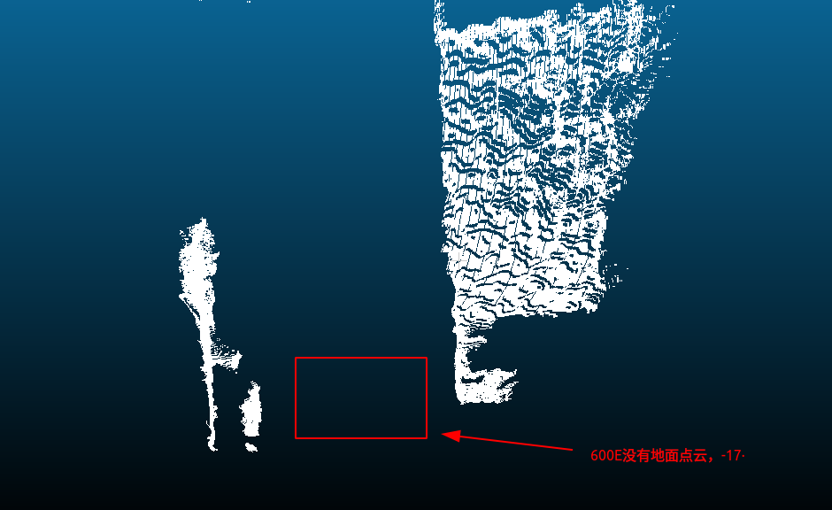
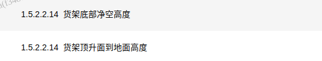

# 避障问题汇总


#### **开发调试常用**

```shell
ls -l /sros/bin/sros     #  查看sros可执行程序
/sros/bin/sros --version # 查看sros版本

systemctl status sros  # 查看sros运行状态
systemctl stop sros    # 停止sros程序运行
systemctl start sros   # 启动sros程序运行
systemctl status ui_server # 查看Matrix运行状态
systemctl stop ui_server   # 停止Matrix程序运行
systemctl start ui_server  # 启动Matrix程序运行
# 改软链接
cd /sros/bin/
ls -lrt
./sros_a3be7aa-nxp  --v个sros文件，找出好用的历史版本
ln -sf sros_a3be7aa-nxp sros # 示例，改sros软链接

journalctl -f  # 查看实时日志 #只能查看报错信息
# V5.7.0 及以上版本，终端查看实时日志的方式变了
tail -f /sros/log/sros.INFO  # 终端查看 sros 实时日志

                                                                                                                                 # 查看崩溃日志
gdb /sros/bin/sros /sros/log/core-sros-1604006748.142550 # 示例， GDB查看崩溃点 敲bt等

当Matrix不能升级，手动升级方法
在电脑打开终端，scp命令传输升级包到控制器
在控制器系统终端，把升级包文件复制到/sros/update/sros-1.tar.gz
systemctl restart sros  # startup.sh脚本会执行升级

telnet <ip> <port> 可以查看sros提供给matrix的socket连接的端口是否连通，类似可以看 5002，80，8088， 443端口

scp -P 2222 sros root@10.10.91.4:/sros/bin/
sshpass -p SRpasswd@2017 ssh  -p 2222 root@10.10.91.4

git checkout 399c6190c6315df6bfbcb8aaed52d006e096f2f9 modules/obstacle/sensor_manager/sensor_process_alg.cpp
git checkout  -- modules/obstacle/sensor_manager/sensor_process_alg.cpp

cat /sros/log/sros.INFO | grep "card_detection.cpp:491] {task}    goal in agv world pose:" > /sros/debug_data/test.txt
cd /d d:   

gdb

watch -n 0.1 ls -htal   实时监控文件变化情况
vi /usr/lib/OpenNI2/Drivers/orbbec.ini  奥比驱动参数调整

#VPN 后台运行
nohup ./cfw & disown

#避障调试技巧

```


#### 其他备注：

版本管理：微重构在main开发   切换到稳定的版本 按tag版本

北京中呈-衡阳铁路项目现场也出现点云偶发闪现 在开灯和拐弯很容易出现误报，和比亚迪项目叉车类似，这种一致性问题需要协助一下，看是否和比亚迪项目一样统一固件升级解决？

测距降低对定位精度影响大吗？如果影响在接受范围内 就可以给O车配置上 新配置能解决叉车的偶发问题  讲道理o车也能解决；

重构避障相机点云处理部分

1.拆解原避障相机点云处理算法到point_cloud_process；
2.重写算法内部参数表；
3.自测避障输出信息和老版本结果一致；


### 储备数据：

- [ ] angle_increment......0.00311666
- [ ] 大白避障相机 640*480 30万个点     实际256000   640 * 400  sin(1°) 的值约为 0.01745240643728351  




- [ ] 162 172 取放货

- [ ] 600e 向上倾斜度  能否看见地面？

1.

1,二维码、货架正向定义？

2.rack_leg_diameter


