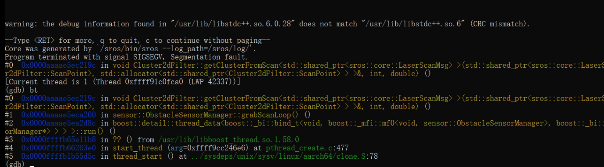
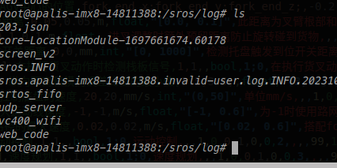
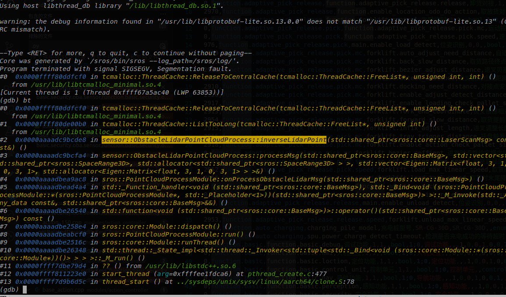
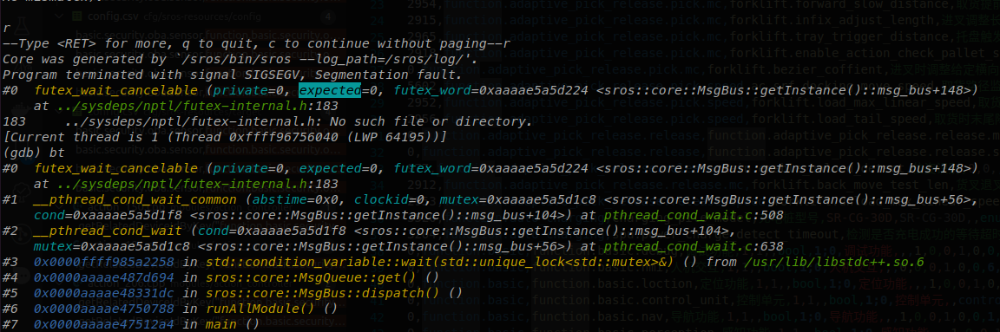
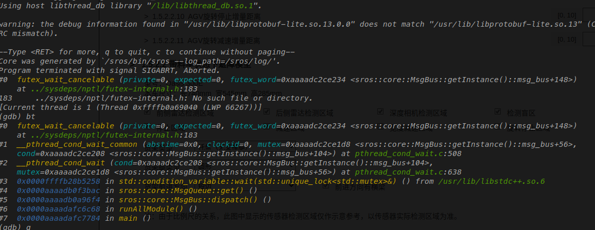
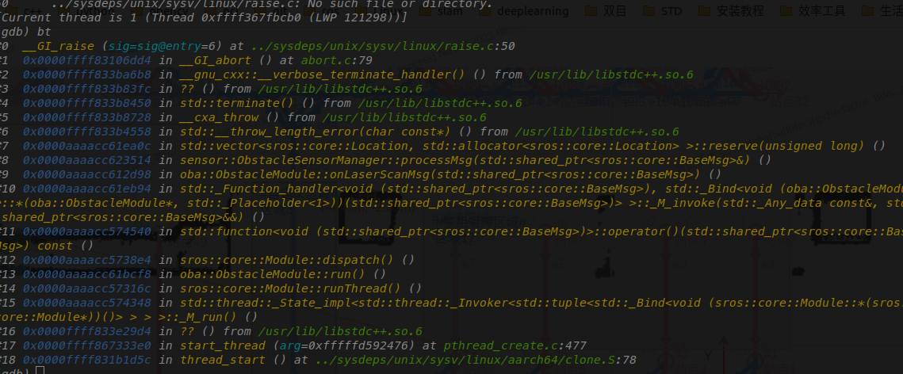

# 避障问题汇总

**现场反馈实际问题 成因分析**


#### **比亚迪偶发避障问题**

- oradar 1512  mian 2505  sick 240
- 

- 555 原始代码加log
- 444 只开启 后避障雷达的cluster
- 关闭后避障雷达 机器重连

**FAE&&研发联调过程：**

- 工厂环境下跑图，后侧ORADAR避障雷达误触发较多，且呈现在==**特定区域的叉臂区域附近**==；

- 遮挡左右侧SICK雷达，仅测试后侧ORADAR，触发误触发较多，排除其他雷达频段干扰；

- 添加聚类滤波算法，未见明显改善，偶发的杂点并==**不完全是孤立点**==；

- 调高叉臂到1m, 同时用白色泡沫遮挡上下叉臂，==**误触发频率减少**==。

  ​             

**测试总结：**

- 结合工厂强光环境下，且地面是金属等高反材质，比较容易形成==**多次反射干扰**==雷达；
- 干扰源呈偶发、集聚特点；


**解决思路：**

- 数据端：联系供应商针对强光高反环境下的是否有相应优化，可配合调整传感器参数及更新SDK；
- 算法端：根据测试经验，滤掉整个叉臂附近区域，是否会对取放货等任务有影响还需进一步评估；
- 业务端：前进过程可以暂时关闭后侧避障功能；
- 产品端：同时用三个SICK, 替换后侧ORADAR避障雷达。


#### **开发调试常用**

```shell
ls -l /sros/bin/sros     #  查看sros可执行程序
/sros/bin/sros --version # 查看sros版本

systemctl status sros  # 查看sros运行状态
systemctl stop sros    # 停止sros程序运行

# 改软链接
cd /sros/bin/
ls -lrt
./sros_a3be7aa-nxp  --version  # 示例，查看每一个sros文件，找出好用的历史版本
ln -sf sros_a3be7aa-nxp sros # 示例，改sros软链接

systemctl start sros   # 启动sros程序运行

systemctl status ui_server # 查看Matrix运行状态
systemctl stop ui_server   # 停止Matrix程序运行
systemctl start ui_server  # 启动Matrix程序运行


journalctl -f  # 查看实时日志

# V5.7.0 及以上版本，终端查看实时日志的方式变了

tail -f /sros/log/sros.INFO  # 终端查看 sros 实时日志

journalctl -f  #只能查看报错信息


ls -l /sros/log/core*   # 查看崩溃日志
gdb /sros/bin/sros /sros/log/core-sros-1604006748.142550 # 示例， GDB查看崩溃点 敲bt等

当Matrix不能升级，手动升级方法
在电脑打开终端，scp命令传输升级包到控制器
在控制器系统终端，把升级包文件复制到/sros/update/sros-1.tar.gz
systemctl restart sros  # startup.sh脚本会执行升级

telnet <ip> <port> 可以查看sros提供给matrix的socket连接的端口是否连通，类似可以看 5002，80，8088， 443端口

scp -P 2222 sros root@10.10.91.4:/sros/bin/
sshpass -p SRpasswd@2017 ssh  -p 2222 root@10.10.91.4

git checkout 399c6190c6315df6bfbcb8aaed52d006e096f2f9 modules/obstacle/sensor_manager/sensor_process_alg.cpp
git checkout  -- modules/obstacle/sensor_manager/sensor_process_alg.cpp

cat /sros/log/sros.INFO | grep "card_detection.cpp:491] {task}    goal in agv world pose:" > /sros/debug_data/test.txt
cd /d d:   

gdb

```


#### 其他备注：

版本管理：微重构在main开发   切换到稳定的版本 按tag版本


北京中呈-衡阳铁路项目现场也出现点云偶发闪现 在开灯和拐弯很容易出现误报，和比亚迪项目叉车类似，这种一致性问题需要协助一下，看是否和比亚迪项目一样统一固件升级解决？


测距降低对定位精度影响大吗？如果影响在接受范围内 就可以给O车配置上 新配置能解决叉车的偶发问题  讲道理o车也能解决；


重构避障相机点云处理部分

1.拆解原避障相机点云处理算法到point_cloud_process；
2.重写算法内部参数表；
3.自测避障输出信息和老版本结果一致；


10.10.71.1

watch -n 0.1 ls -htal

v








