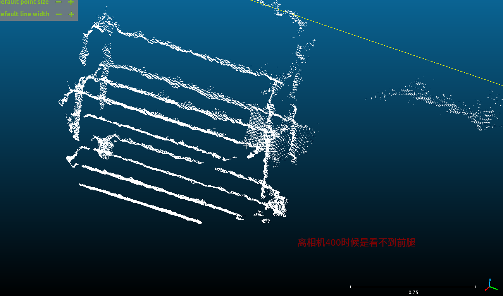
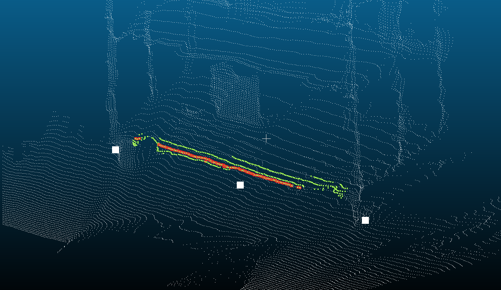
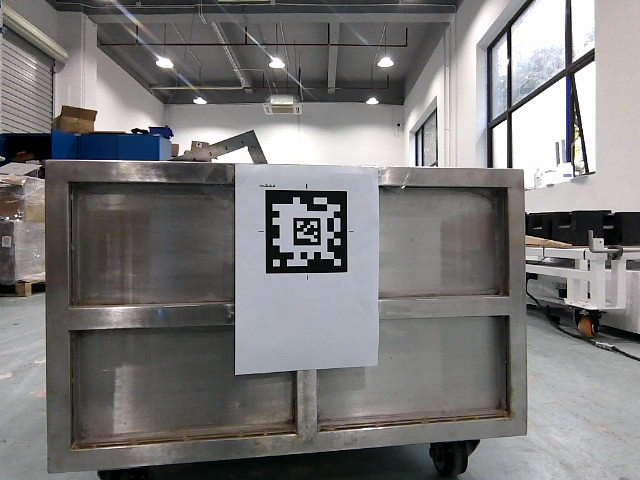
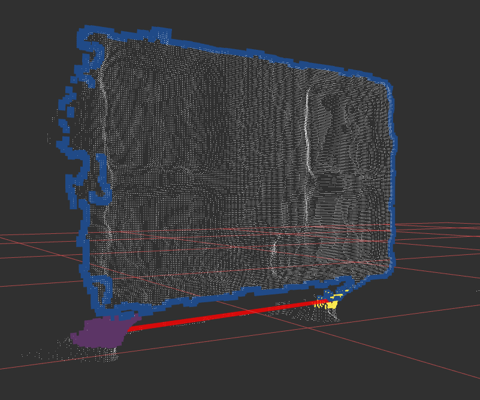
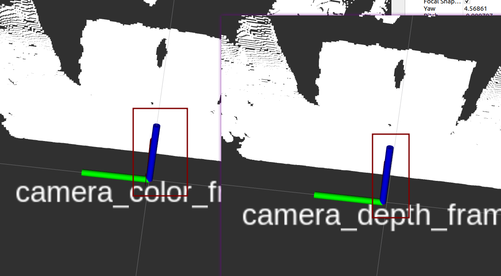

## L型超低矮

gxf/feat_material_cart_detect_main

 sudo chown -R gxf:gxf .   

​    auto dev_setter = sros::core::SettingDevice::getInstance();

检测器设计为一个矩形滑动窗口（例如y方向长度0.2，z方向高度为0.02），在该检测step高度点云遍历执行这个滑动窗口，如果检测器设计为一个矩形滑动窗口（例如y方向长度0.2，z方向高度为0.02），在该检测step高度点云遍历执行这个滑动窗口，如果背景：
我需要识别料车料箱（都是带轮子的），用3D相机采集数据，我需要提取料车料箱的距离相机最近的下沿杠（朝着相机）的点云数据作为拟合直线的数据源
前置条件：相机安装在小车上面，相机坐标系已经转换为基于baselink的坐标系，及前方为x，高度为z
我的初步设计思路：
我想先把点云投影到YOZ平面，再平面提取下沿杠，减少计算量，让后按照地面生长（z方向）高度step=0.02m间隔从0开始逐渐检测符合条件的点，现在需要设计一下检测器，    sros::core::DeviceItem dev_item = s.getDeviceItemByKey("function.basic.perception.sensor.camera_1");

​    auto item = dev_setter->getDeviceItem(img->sensor_name);

root@rk3399-yocto:~# tail -f /sros/log/sros.INFO | grep "pallet in global pose" I0414 12:56:08.840185 479604 action_167.cpp:74] pallet in global pose : Pose(-1.30999, 0.34204, 0, 0, 0, 3.15419)


I0414 13:14:20.655741 686914 tf3d.cpp:50] tf3d_rpy:  -0.11817  -6.82481 -0.594441

I0414 13:14:20.655768 686914 tf3d.cpp:52] T_hole_in_agv tf3d_t: -1.68311   0.00696611 0.347446  


I0414 13:09:31.500041 686914 material_cart_detection.cpp:212] Average T_hole_in_agv (euler): -179.666

I0414 13:09:31.500059 686914 material_cart_detection.cpp:213] Average T_hole_in_agv (t):  -1.70721 0.0485123         0


实测调试，依赖轮子找中心点不准

91ddc461db9f236a809c4c0a56e14aadecc94dbc




L型车长1500 车宽700

手推车：下沿杠高180mm 宽1100mm

料架车：下沿杠高180mm 宽1300mm


  tail -f /sros/log/sros.INFO | grep "cluster\|the pose in sensor" | tee -a a.txt

cd /sros/log/data/ && tail -f /sros/log/sros.INFO | grep "cluster\|the pose in sensor" | tee  a.txt

action 顶升 192-8-19


## 后牵引

**载具情况：**




密封箱体车：下沿杠高120mm 宽700m
开发分支sros分支：perry_merge_rear_tractor_on_5.33.x

开发分支感知仓库分支：gxf/material_cart_detect_v3.11.x 

感知传感器大黑funkey：function.basic.perception.sensor.camera_1
135-1-x  x代表识别站点151-1-x 挂钩操作：脱钩0，挂钩1
151-2-x 旋转机构使能： 使能1，去使能0
151-4-0 旋转部分校准/回中，开机首次执行才会校准，后面执行只回中
151-5-x 行走轮使能： 使能1，去使能0
感知调试：二维码 189 1 11081111    纯点云 189 1 11201111

T_hole_in_agvtf3d_rpy

tail -f /sros/log/sros.INFO  | grep "T_hole_in_agv"

tail -f /sros/log/sros.INFO  | grep "the pose in sensor: x:\|对接中心点:\|料车\|is_extract_ok"

bolt -476     476代表agv中心到对接钩的距离 值越大车会停止在钩之前即调整的距离越小


#### **对接精度分析**

感知：

- [ ] 工作距离     二维码和深度相机测出来不一样
- [ ] 直线拟合

运控：

- [ ] 对接点
- [ ] 贝塞尔调整点
- [ ] 是否运动到目标点


#### BUG排查

- [x] 边界点云累加没清除导致提取直线角度上帧残留另一侧的

- [ ]  过曝导致孔洞

- [x] 异常情况没有赋值为0保留上次角度

- [ ] 下采样之后，先编译直线拟合欠佳

- [ ] 直线拟合后，用得轮子数据X方向应该加个3cm的offset

- [ ] 如果只有一个交点，可预设车宽推测出另外一个交点

- [x] 边界不干净，需要半径过滤后再提取边界（倾斜大和金属材质会导致拍到另一侧的点云）

  


#### 新优化思路

- 下沿杠数据可以用由下生长的点云区域来拟合 边缘的点少且不够稳定

```c++
#include <pcl/point_cloud.h>
#include <pcl/point_types.h>
#include <set>
#include <vector>
#include <tuple>

// 自定义比较器，用于点的排序和去重
struct PointComparator {
    bool operator()(const pcl::PointXYZ& a, const pcl::PointXYZ& b) const {
        return std::tie(a.x, a.y, a.z) < std::tie(b.x, b.y, b.z);
    }
};

/**
 * @brief 在点云中找到每个点邻域内 x 方向最近的点，并去除重复点
 * @param cloud 输入点云
 * @param search_box_x 邻域框在 x 方向的长度（中心点为起点）
 * @param search_box_y 邻域框在 y 方向的长度（中心点为起点）
 * @param search_box_z 邻域框在 z 方向的长度（中心点为起点）
 * @return 返回筛选后的点云
 */
pcl::PointCloud<pcl::PointXYZ>::Ptr filterNearestPoints(
    const pcl::PointCloud<pcl::PointXYZ>::Ptr& cloud,
    float search_box_x,
    float search_box_y,
    float search_box_z) {

    pcl::PointCloud<pcl::PointXYZ>::Ptr filtered_cloud(new pcl::PointCloud<pcl::PointXYZ>());
    std::set<pcl::PointXYZ, PointComparator> unique_points; // 用于去重

    // 遍历点云中的每个点
    for (const auto& current_point : cloud->points) {
        float min_x_distance = std::numeric_limits<float>::max();
        pcl::PointXYZ nearest_point;

        // 遍历候选点，找到邻域内 x 方向最近的点
        for (const auto& candidate_point : cloud->points) {
            if (candidate_point.x == current_point.x && 
                candidate_point.y == current_point.y && 
                candidate_point.z == current_point.z) {
                continue; // 跳过自身
            }

            // 判断点是否在立体框内
            if (std::abs(candidate_point.x - current_point.x) <= search_box_x / 2 &&
                std::abs(candidate_point.y - current_point.y) <= search_box_y / 2 &&
                std::abs(candidate_point.z - current_point.z) <= search_box_z / 2) {
                
                // 更新 x 方向最近点
                float x_distance = std::abs(candidate_point.x - current_point.x);
                if (x_distance < min_x_distance) {
                    min_x_distance = x_distance;
                    nearest_point = candidate_point;
                }
            }
        }

        // 如果找到符合条件的点，并且没有记录过
        if (min_x_distance != std::numeric_limits<float>::max() &&
            unique_points.find(nearest_point) == unique_points.end()) {
            filtered_cloud->points.push_back(nearest_point);
            unique_points.insert(nearest_point); // 记录点用于去重
        }
    }

    return filtered_cloud;
}

int main() {
    // 创建输入点云
    pcl::PointCloud<pcl::PointXYZ>::Ptr cloud(new pcl::PointCloud<pcl::PointXYZ>());
    cloud->push_back(pcl::PointXYZ(0.0, 0.0, 0.0));
    cloud->push_back(pcl::PointXYZ(0.05, 0.005, 0.01));
    cloud->push_back(pcl::PointXYZ(0.08, 0.002, -0.01));
    cloud->push_back(pcl::PointXYZ(0.2, 0.1, 0.1));

    // 调用函数，定义邻域尺寸
    float search_box_x = 0.1; // x方向邻域长度
    float search_box_y = 0.01; // y方向邻域长度
    float search_box_z = 0.02; // z方向邻域长度

    pcl::PointCloud<pcl::PointXYZ>::Ptr filtered_cloud = filterNearestPoints(cloud, search_box_x, search_box_y, search_box_z);

    // 输出结果
    for (const auto& point : filtered_cloud->points) {
        std::cout << "Filtered Point: [" << point.x << ", " << point.y << ", " << point.z << "]\n";
    }

    return 0;
}

```



