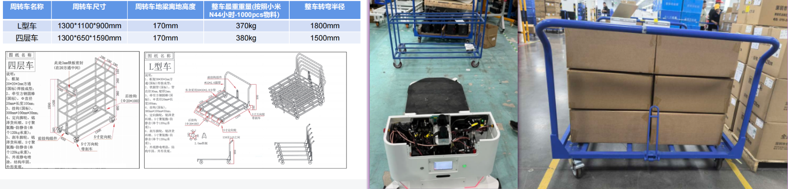
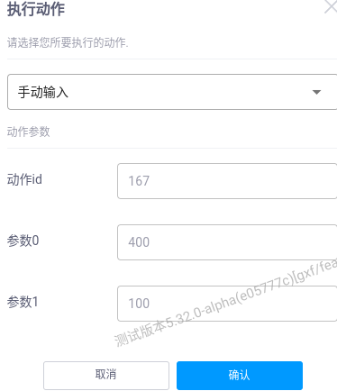
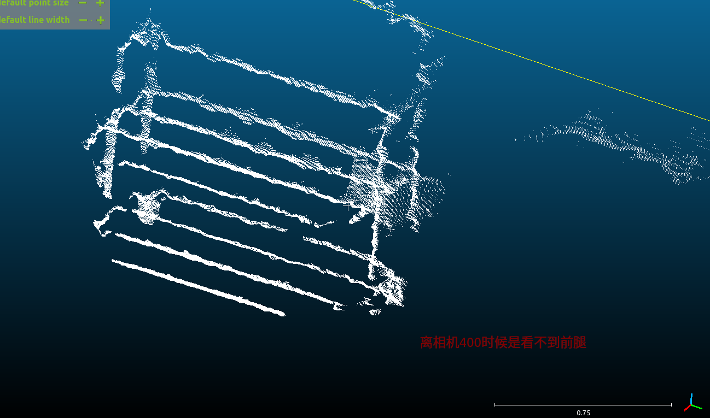
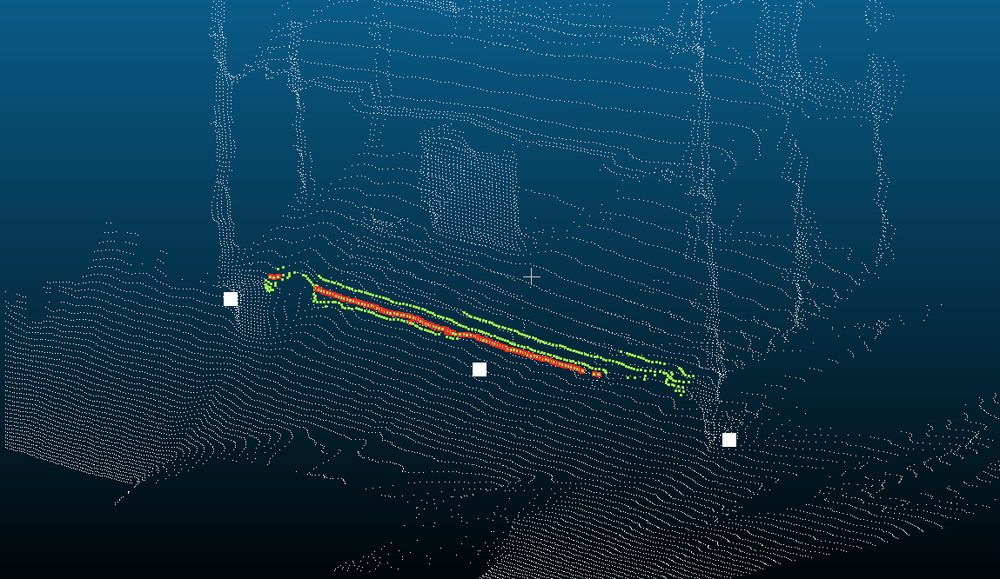
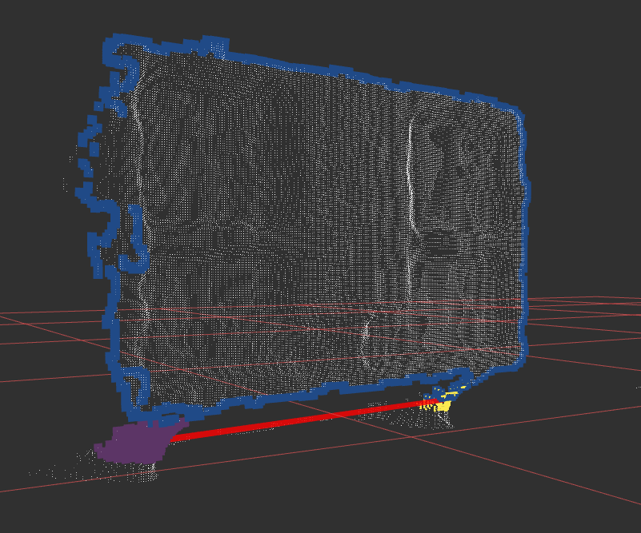
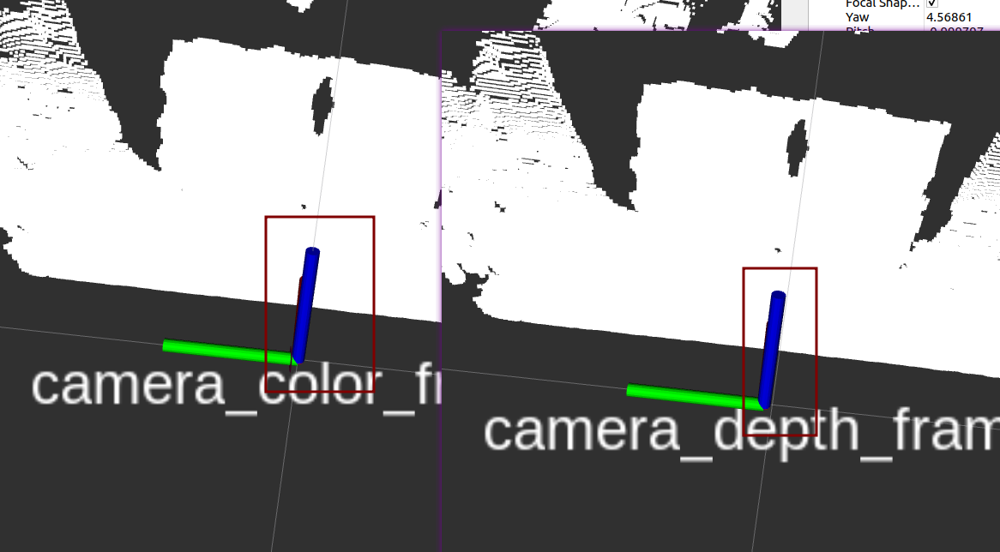
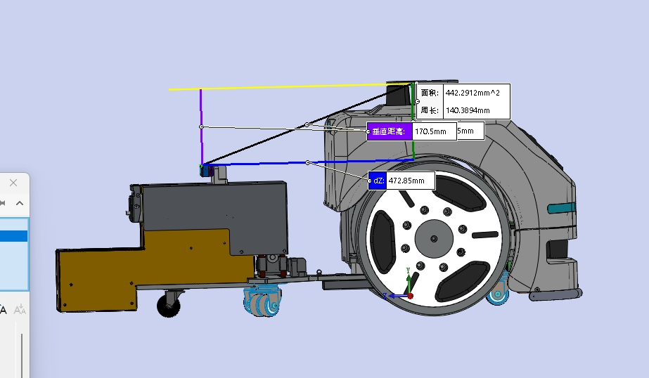
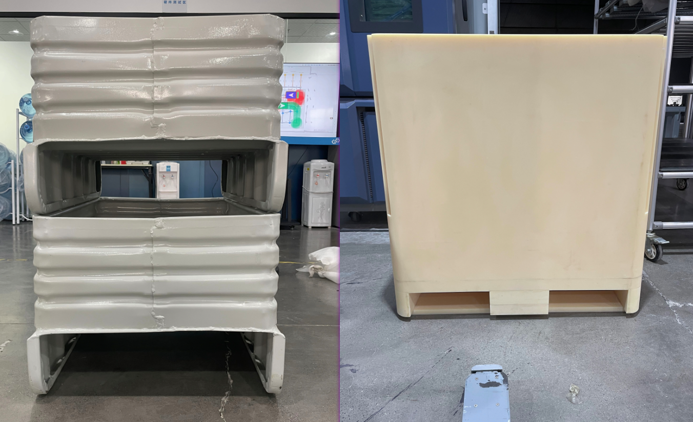
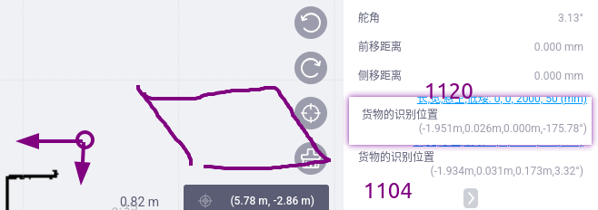
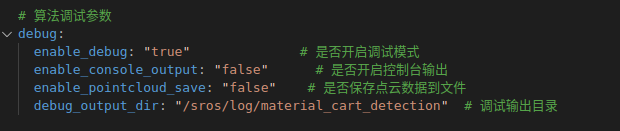

## L型超低矮



gxf/feat_material_cart_detect_main

 sudo chown -R gxf:gxf .   

​    auto dev_setter = sros::core::SettingDevice::getInstance();

检测器设计为一个矩形滑动窗口（例如y方向长度0.2，z方向高度为0.02），在该检测step高度点云遍历执行这个滑动窗口，如果检测器设计为一个矩形滑动窗口（例如y方向长度0.2，z方向高度为0.02），在该检测step高度点云遍历执行这个滑动窗口，如果背景：
我需要识别料车料箱（都是带轮子的），用3D相机采集数据，我需要提取料车料箱的距离相机最近的下沿杠（朝着相机）的点云数据作为拟合直线的数据源
前置条件：相机安装在小车上面，相机坐标系已经转换为基于baselink的坐标系，及前方为x，高度为z
我的初步设计思路：
我想先把点云投影到YOZ平面，再平面提取下沿杠，减少计算量，让后按照地面生长（z方向）高度step=0.02m间隔从0开始逐渐检测符合条件的点，现在需要设计一下检测器，    sros::core::DeviceItem dev_item = s.getDeviceItemByKey("function.basic.perception.sensor.camera_1");

​    auto item = dev_setter->getDeviceItem(img->sensor_name);

root@rk3399-yocto:~# tail -f /sros/log/sros.INFO | grep "pallet in global pose" I0414 12:56:08.840185 479604 action_167.cpp:74] pallet in global pose : Pose(-1.30999, 0.34204, 0, 0, 0, 3.15419)




I0414 13:14:20.655741 686914 tf3d.cpp:50] tf3d_rpy:  -0.11817  -6.82481 -0.594441

I0414 13:14:20.655768 686914 tf3d.cpp:52] T_hole_in_agv tf3d_t: -1.68311   0.00696611 0.347446  


I0414 13:09:31.500041 686914 material_cart_detection.cpp:212] Average T_hole_in_agv (euler): -179.666

I0414 13:09:31.500059 686914 material_cart_detection.cpp:213] Average T_hole_in_agv (t):  -1.70721 0.0485123         0


实测调试，依赖轮子找中心点不准

91ddc461db9f236a809c4c0a56e14aadecc94dbc




L型车长1500 车宽700

手推车：下沿杠高180mm 宽1100mm

料架车：下沿杠高180mm 宽1300mm


  tail -f /sros/log/sros.INFO | grep "cluster\|the pose in sensor" | tee -a a.txt

cd /sros/log/data/ && tail -f /sros/log/sros.INFO | grep "cluster\|the pose in sensor" | tee  a.txt

action 顶升 192-8-19


## 后牵引

**载具情况：**


密封箱体车：下沿杠高120mm 宽700m
开发分支sros分支：perry_merge_rear_tractor_on_5.33.x

开发分支感知仓库分支：gxf/material_cart_detect_v3.11.x 

感知传感器大黑funkey：function.basic.perception.sensor.camera_1
135-1-x  x代表识别站点151-1-x 挂钩操作：脱钩0，挂钩1
151-2-x 旋转机构使能： 使能1，去使能0
151-4-0 旋转部分校准/回中，开机首次执行才会校准，后面执行只回中
151-5-x 行走轮使能： 使能1，去使能0
感知调试：二维码 189 1 11081111    纯点云 189 1 11201111

T_hole_in_agvtf3d_rpy

tail -f /sros/log/sros.INFO  | grep "T_hole_in_agv"

tail -f /sros/log/sros.INFO  | grep "the pose in sensor: x:\|对接中心点:\|料车\|is_extract_ok"

bolt -476     476代表agv中心到对接钩的距离 值越大车会停止在钩之前即调整的距离越小


#### **对接精度分析**

感知：

- [ ] 工作距离     二维码和深度相机测出来不一样
- [ ] 直线拟合

运控：

- [ ] 对接点
- [ ] 贝塞尔调整点
- [ ] 是否运动到目标点


#### BUG排查

- [x] 边界点云累加没清除导致提取直线角度上帧残留另一侧的

- [ ]  过曝导致孔洞

- [x] 异常情况没有赋值为0保留上次角度

- [ ] 下采样之后，先编译直线拟合欠佳

- [ ] 直线拟合后，用得轮子数据X方向应该加个3cm的offset

- [ ] 如果只有一个交点，可预设车宽推测出另外一个交点

- [x] 边界不干净，需要半径过滤后再提取边界（倾斜大和金属材质会导致拍到另一侧的点云）

  


#### 新优化思路

- 下沿杠数据可以用由下生长的点云区域来拟合 边缘的点少且不够稳定

```c++
#include <pcl/point_cloud.h>
#include <pcl/point_types.h>
#include <set>
#include <vector>
#include <tuple>

// 自定义比较器，用于点的排序和去重
struct PointComparator {
    bool operator()(const pcl::PointXYZ& a, const pcl::PointXYZ& b) const {
        return std::tie(a.x, a.y, a.z) < std::tie(b.x, b.y, b.z);
    }
};

/**
 * @brief 在点云中找到每个点邻域内 x 方向最近的点，并去除重复点
 * @param cloud 输入点云
 * @param search_box_x 邻域框在 x 方向的长度（中心点为起点）
 * @param search_box_y 邻域框在 y 方向的长度（中心点为起点）
 * @param search_box_z 邻域框在 z 方向的长度（中心点为起点）
 * @return 返回筛选后的点云
 */
pcl::PointCloud<pcl::PointXYZ>::Ptr filterNearestPoints(
    const pcl::PointCloud<pcl::PointXYZ>::Ptr& cloud,
    float search_box_x,
    float search_box_y,
    float search_box_z) {

    pcl::PointCloud<pcl::PointXYZ>::Ptr filtered_cloud(new pcl::PointCloud<pcl::PointXYZ>());
    std::set<pcl::PointXYZ, PointComparator> unique_points; // 用于去重

    // 遍历点云中的每个点
    for (const auto& current_point : cloud->points) {
        float min_x_distance = std::numeric_limits<float>::max();
        pcl::PointXYZ nearest_point;

        // 遍历候选点，找到邻域内 x 方向最近的点
        for (const auto& candidate_point : cloud->points) {
            if (candidate_point.x == current_point.x && 
                candidate_point.y == current_point.y && 
                candidate_point.z == current_point.z) {
                continue; // 跳过自身
            }

            // 判断点是否在立体框内
            if (std::abs(candidate_point.x - current_point.x) <= search_box_x / 2 &&
                std::abs(candidate_point.y - current_point.y) <= search_box_y / 2 &&
                std::abs(candidate_point.z - current_point.z) <= search_box_z / 2) {
                
                // 更新 x 方向最近点
                float x_distance = std::abs(candidate_point.x - current_point.x);
                if (x_distance < min_x_distance) {
                    min_x_distance = x_distance;
                    nearest_point = candidate_point;
                }
            }
        }

        // 如果找到符合条件的点，并且没有记录过
        if (min_x_distance != std::numeric_limits<float>::max() &&
            unique_points.find(nearest_point) == unique_points.end()) {
            filtered_cloud->points.push_back(nearest_point);
            unique_points.insert(nearest_point); // 记录点用于去重
        }
    }

    return filtered_cloud;
}

int main() {
    // 创建输入点云
    pcl::PointCloud<pcl::PointXYZ>::Ptr cloud(new pcl::PointCloud<pcl::PointXYZ>());
    cloud->push_back(pcl::PointXYZ(0.0, 0.0, 0.0));
    cloud->push_back(pcl::PointXYZ(0.05, 0.005, 0.01));
    cloud->push_back(pcl::PointXYZ(0.08, 0.002, -0.01));
    cloud->push_back(pcl::PointXYZ(0.2, 0.1, 0.1));

    // 调用函数，定义邻域尺寸
    float search_box_x = 0.1; // x方向邻域长度
    float search_box_y = 0.01; // y方向邻域长度
    float search_box_z = 0.02; // z方向邻域长度

    pcl::PointCloud<pcl::PointXYZ>::Ptr filtered_cloud = filterNearestPoints(cloud, search_box_x, search_box_y, search_box_z);

    // 输出结果
    for (const auto& point : filtered_cloud->points) {
        std::cout << "Filtered Point: [" << point.x << ", " << point.y << ", " << point.z << "]\n";
    }

    return 0;
}

```





## YKK适配三种类型载具

#### **对接载具：**




#### **基本信息：**

高度：30cm   宽度：60-65


#### **位姿识别方案：**

**方案一：**后牵引思路，边缘提取，三线拟合找两交点     

**方案二：**L型下沿杠思路，找到轮子区域的在直线最近的端点

**方案三：**以手柄为特征来找端点


## CARTER料箱

**对接载具：**两墩面和三顿面共存（无轮）




**对接车型：**MP15 = gxf/carter_dock_5.53.x 

**开发分支： **sros分支=       pecrtion分支= gxf/perception_v3.12.x_carter

5.45.2-alpha(12ca6dd)[v5.45.2-alpha] May 22 2025 11:38:35

**开发思考：**

- 多载具数量多且结构差异较大 是否考虑参数和载具绑定（通过部署对接位置）；
- 模版匹配方案也需要绑定载具；



目前sros定义的对接载具方向：货架对接面垂直指向车体

实测：叉臂外宽55cm  载具一内宽61cm

24-5-150

载具二：Closest wheel pair distance: 0.763314


二维码调试相关

MP15行为树触发162动作

```c++
0930 15:08:17.094220 487504 lift_fork_node.cpp:18] onStart
I0930 15:08:17.094339 487504 lift_fork_node.cpp:31] target_height=0.15
I0930 15:08:17.094444 487504 lift_fork_node.cpp:33] SUCCESS
I0930 15:08:17.094640 487504 pallet_detect_node.cpp:23] onStart
I0930 15:08:17.094792 487504 pallet_detect_node.cpp:63] last_detect_ticket_: 0
I0930 15:08:17.094924 487516 perception_manager_module.cpp:228] {action-task} onDetectCommandMsg: cmd:106 pose:1.16,2.25,-1.57079 goal_id,-1
I0930 15:08:17.094928 487488 main_module.cpp:1994] {command-hander} 关闭避障
I0930 15:08:17.095084 487516 perception_manager_module.cpp:276] {action-task} undefined command load command
I0930 15:08:17.095733 487504 action_controller_module_2.cpp:541] mc or ac state change
I0930 15:08:17.095825 487504 action_controller_module_2.cpp:413] add fault code 0
E0930 15:08:17.096179 487504 fault_center.cpp:91] map::at, fault_code:0
I0930 15:08:17.096320 487504 action_controller_module_2.cpp:429] recive detect result: 1
I0930 15:08:17.142452 487504 is_tree_not_in_cancel.cpp:10] tick IsTreeNotInCancel
I0930 15:08:17.142531 487504 is_fork_tip_and_root_collison_not_trigger.cpp:11] tick IsForkTipAndRootCollisonNotTrigger
I0930 15:08:17.142588 487504 is_fork_tip_and_root_collison_not_trigger.cpp:21] IsForkTipAndRootCollisonNotTrigger success
I0930 15:08:17.142798 487504 pallet_detect_node.cpp:118] FAILURE
I0930 15:08:17.142851 487504 pallet_detect_node.cpp:23] onStart
I0930 15:08:17.142958 487504 pallet_detect_node.cpp:63] last_detect_ticket_: 1
I0930 15:08:17.143045 487516 perception_manager_module.cpp:228] {action-task} onDetectCommandMsg: cmd:106 pose:1.16,2.25,-1.57079 goal_id,-1
I0930 15:08:17.143155 487516 perception_manager_module.cpp:276] {action-task} undefined command load command
I0930 15:08:17.143306 487504 action_controller_module_2.cpp:429] recive detect result: 2
I0930 15:08:17.192534 487504 is_tree_not_in_cancel.cpp:10] tick IsTreeNotInCancel
I0930 15:08:17.192620 487504 is_fork_tip_and_root_collison_not_trigger.cpp:11] tick IsForkTipAndRootCollisonNotTrigger
I0930 15:08:17.192781 487504 is_fork_tip_and_root_collison_not_trigger.cpp:21] IsForkTipAndRootCollisonNotTrigger success
I0930 15:08:17.192831 487504 pallet_detect_node.cpp:118] FAILURE
I0930 15:08:17.192854 487504 pallet_detect_node.cpp:23] onStart
I0930 15:08:17.192945 487504 pallet_detect_node.cpp:63] last_detect_ticket_: 2
I0930 15:08:17.193470 487516 perception_manager_module.cpp:228] {action-task} onDetectCommandMsg: cmd:106 pose:1.16,2.25,-1.57079 goal_id,-1
I0930 15:08:17.193572 487516 perception_manager_module.cpp:276] {action-task} undefined command load command
I0930 15:08:17.193738 487504 action_controller_module_2.cpp:429] recive detect result: 3
I0930 15:08:17.242630 487504 is_tree_not_in_cancel.cpp:10] tick IsTreeNotInCancel
I0930 15:08:17.242717 487504 is_fork_tip_and_root_collison_not_trigger.cpp:11] tick IsForkTipAndRootCollisonNotTrigger
I0930 15:08:17.242734 487504 is_fork_tip_and_root_collison_not_trigger.cpp:21] IsForkTipAndRootCollisonNotTrigger success
I0930 15:08:17.242774 487504 pallet_detect_node.cpp:118] FAILURE
I0930 15:08:17.242810 487504 cancel_src_task.cpp:12] onStart
I0930 15:08:17.242833 487504 src_sdk.cpp:206] cancelAction no: 1
I0930 15:08:17.242940 487504 src_sdk.cpp:211] correct src action no: 1
I0930 15:08:17.243006 487504 msg_handle.cpp:1094] cmd:0x42 param(1, 0, 0, 0, 0), 0
I0930 15:08:17.292747 487504 cancel_src_task.cpp:40] SUCCESS
I0930 15:08:17.292835 487504 sync_cancel_move_task.cpp:10] onStart
I0930 15:08:17.293244 487488 main_module.cpp:1197] {command-hander} Handling CMD_CANCEL_MOVEMENT_TASK command， soft_cancel is 0
W0930 15:08:17.293478 487488 main_module.cpp:1204] {exec-error} 330001 ERROR_CODE_CANCEL_MOVEMENT_TASK_NOT_RUNNING Cancel movement task, but task not running!
I0930 15:08:17.342869 487504 sync_cancel_move_task.cpp:31] SUCCESS
I0930 15:08:17.342985 487504 honey_well_scan_node.cpp:12] onStart
I0930 15:08:17.343150 487488 main_module.cpp:1989] {command-hander} 开启避障
I0930 15:08:17.343338 487504 action_task.cpp:6] {action-task} 5(162,3,150,0,)finished result:3,result_value:340862,result_str:
I0930 15:08:17.343408 487504 task_manager.cpp:415] Reset pause state after action task finish
I0930 15:08:17.343508 487504 task_manager.cpp:128] {action-task} Action task 5 slave finish failed! failed code is 340862
I0930 15:08:17.343623 487513 mission_module.cpp:375] MissionModule::onNotifyMsg(): type=1
I0930 15:08:17.343669 487497 network_module.cpp:3579] 不是网络发的通知，忽略！：   seq: 167 sessionId: 1759216024627
E0930 15:08:17.343688 487513 mission_module.cpp:389] {task} Action task execute failed, result 3 failed code: 340862
I0930 15:08:17.343744 487531 alarm_record.cpp:199] SQL: insert into error_log (level, type, error_code, task_no, details, describe, how_to_fix, occurr_time, time_stamp_int, cur_system_state, cur_speed) values(3,1,340862,5,'Action command: (162,3,150)','栈板识别失败','检查相机视野或联系研发检查图片质量','2025-09-30 15:08:17','1759216097343',-478332656,0.000000)
```


```c++
I0923 11:47:01.526786 38763 QRcode_detection_global.cpp:61] {action-task} receive QRcode detect command : cmd:18 pose:0,0,0 goal_id,-1
I0923 11:47:01.526918 38763 detection_base.cpp:24] send TOPIC_SVC100_ENABLE_PUBLISH msg: enableSensor
I0923 11:47:01.527134 38740 halley_camera.cpp:225] data stream enable OK
I0923 11:47:01.705926 38763 QRcode_detection_global.cpp:221] fm time is:0.015325,freq is:65.2529
I0923 11:47:01.706024 38763 tf3d.cpp:45] Qrcode_global tf3d_quaternion: -0.00791794 0.0115312 -0.00665435 0.99988
I0923 11:47:01.706091 38763 tf3d.cpp:50] Qrcode_globaltf3d_rpy: -0.916294   1.31529 -0.773131
I0923 11:47:01.706133 38763 tf3d.cpp:52] Qrcode_global tf3d_t: -0.00129179 0.0184147  0.418364  
I0923 11:47:01.706238 38763 tf3d.cpp:45] T_hole_in_agv tf3d_quaternion: -0.00665435 -0.00791788 0.0115311 -0.99988
I0923 11:47:01.706266 38763 tf3d.cpp:50] T_hole_in_agvtf3d_rpy: 0.752096 0.916045 -1.31545
I0923 11:47:01.706393 38763 tf3d.cpp:52] T_hole_in_agv tf3d_t: -1.03644   0.00206103 0.359934  
I0923 11:47:01.706451 38763 QRcode_detection_global.cpp:311] T_hole_in_agv euler: 0.752096 0.916045 -1.31545
I0923 11:47:01.706483 38763 tf3d.cpp:45] T_hole_in_world tf3d_quaternion: -0.000874461 -0.00723113 -0.999872 -0.0142235
I0923 11:47:01.706614 38763 tf3d.cpp:50] T_hole_in_worldtf3d_rpy:   0.829976 -0.0884071    178.369
I0923 11:47:01.706662 38763 tf3d.cpp:52] T_hole_in_world tf3d_t: 0.966156   21.1991    0.341684  
I0923 11:47:01.706797 38763 QRcode_detection_global.cpp:317] T_hole_in_world euler:   0.829976 -0.0884071    178.369
I0923 11:47:01.706857 38763 detection_base.cpp:162] {action-task} sendResultMsg cmd:18 result:2 Pose(x:0.966156,y:21.1991,yaw:3.11313)
I0923 11:47:01.707095 38749 action_189.cpp:108] result: 1
    
    
    
    
I0925 15:03:25.233338 173777 main_module.cpp:1822] {command-hander} CMD_NEW_ACTION_TASK: 4(1891,11080000),0,
I0925 15:03:25.233438 173777 task_manager.cpp:118] {action-task} Action task 4 wait for start!
I0925 15:03:25.238579 173777 src_sdk.cpp:195] will map sros action no to src action no:0 AC_no:43658 MC_no:0
I0925 15:03:25.238700 173777 main_module.cpp:1874] tryEnableWaitingDmCodeResult
I0925 15:03:25.238843 173791 base_action.cpp:48] {action-task} startAction(): no 4, id 189, p0 1, p1 11080000, p2 0, pstr
I0925 15:03:25.239059 173791 task_manager.cpp:198] {action-task} Action task 4 start!
I0925 15:03:25.239166 173791 base_action.cpp:381] sendDetect cmd => 18, goal_id-1, detect location coordinate x:0, y:0, yaw:0, obj_center_ground_clearance0, obj_self_height150, current_camera_height0
I0925 15:03:25.239253 173791 action_controller_module.cpp:472] Response command : command = 34 result state = 2 result code = 0 seq = 146 session id = 1758783395645
I0925 15:03:25.239300 173803 perception_manager_module.cpp:228] {action-task} onDetectCommandMsg: cmd:108 pose:0,0,0 goal_id,-1
I0925 15:03:25.239418 173803 QRcode_detection_global.cpp:61] {action-task} receive QRcode detect command : cmd:18 pose:0,0,0 goal_id,-1
I0925 15:03:25.239487 173786 network_module.cpp:1765] {protobuf} Response command 34, result state:2, result code:0, seq:146, session id:1758783395645
I0925 15:03:25.239526 173803 detection_base.cpp:24] send TOPIC_SVC100_ENABLE_PUBLISH msg: enableSensor
I0925 15:03:25.239722 173782 halley_camera.cpp:225] data stream enable OK
I0925 15:03:25.342172 173896 network_module.cpp:321] {protobuf} CMD_NEW_ACTION_TASK
I0925 15:03:25.342437 173777 main_module.cpp:1822] {command-hander} CMD_NEW_ACTION_TASK: 5(1891,11080000),0,
W0925 15:03:25.342612 173777 main_module.cpp:1847] {exec-error} 340002 ERROR_CODE_ACTION_PRE_TASK_RUNNING previous task is running, new task is ignored.
I0925 15:03:25.343181 173786 network_module.cpp:1765] {protobuf} Response command 34, result state:4, result code:340002, seq:147, session id:1758783395645
I0925 15:03:25.378628 173803 QRcode_detection_global.cpp:221] fm time is:0.023555,freq is:42.4538
I0925 15:03:25.378742 173803 tf3d.cpp:45] Qrcode_global tf3d_quaternion: -0.0146452 -0.0010258 -0.00328529 0.999887
I0925 15:03:25.378826 173803 tf3d.cpp:50] Qrcode_globaltf3d_rpy:  -1.67788 -0.123048 -0.374705
I0925 15:03:25.378866 173803 tf3d.cpp:52] Qrcode_global tf3d_t: -0.0085776 0.0443952  0.414674
I0925 15:03:25.378984 173803 tf3d.cpp:45] T_hole_in_agv tf3d_quaternion: -0.00328529 -0.0146451 -0.00102586 -0.999887
I0925 15:03:25.379015 173803 tf3d.cpp:50] T_hole_in_agvtf3d_rpy:  0.37831  1.67786 0.123107
I0925 15:03:25.379069 173803 tf3d.cpp:52] T_hole_in_agv tf3d_t: -1.0338    -0.00210878 0.339994
I0925 15:03:25.379122 173803 QRcode_detection_global.cpp:311] T_hole_in_agv euler:  0.37831  1.67786 0.123107
I0925 15:03:25.379169 173803 tf3d.cpp:45] T_hole_in_world tf3d_quaternion: 0.00703882 -0.00103526 -0.999975 -0.000116776
I0925 15:03:25.379220 173803 tf3d.cpp:50] T_hole_in_worldtf3d_rpy: 0.118546  0.80661  179.987
I0925 15:03:25.379252 173803 tf3d.cpp:52] T_hole_in_world tf3d_t: 0.960866   -2.05805   0.324232
I0925 15:03:25.379295 173803 QRcode_detection_global.cpp:317] T_hole_in_world euler: 0.118546  0.80661  179.987
I0925 15:03:25.379350 173803 detection_base.cpp:162] {action-task} sendResultMsg cmd:18 result:2 Pose(x:0.960866,y:-2.05805,yaw:3.14137)
I0925 15:03:25.379534 173791 action_189.cpp:108] result: 1
```


#### 纯点云对接数据包获取及算法参数修改

1. ssh工具进入  找到material_cart_detect_params.yaml文件

   

   打开enable_pointcloud_save: "true"    # 是否保存点云数据到文件

   会在"/sros/log/material_cart_detection" 目录里面存*.ply的点云数据文件和 *.txt的位姿估计分析文件

2. 同时导出sros.INFO和 /sros/log/data/文件夹以material_cart.log命名的文件

   