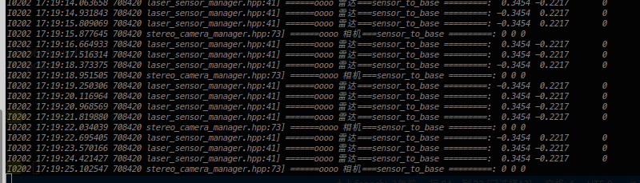
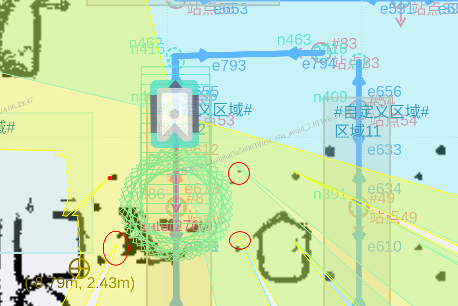
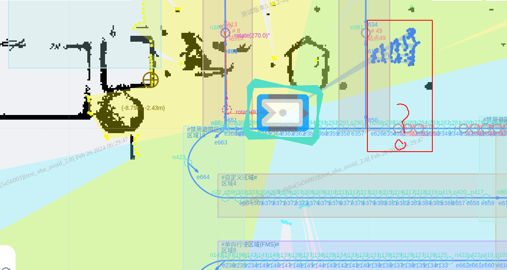
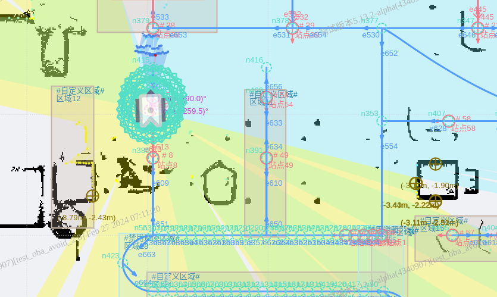
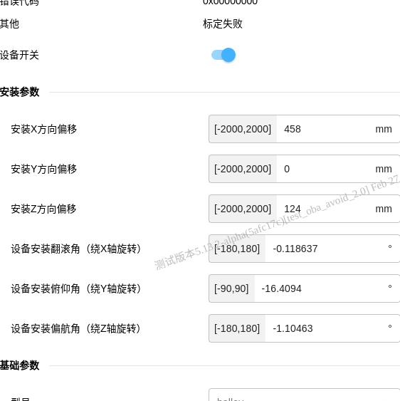
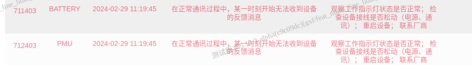
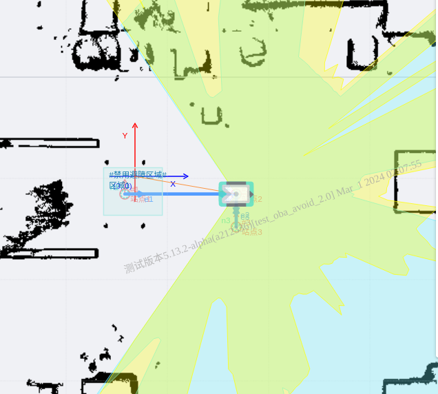
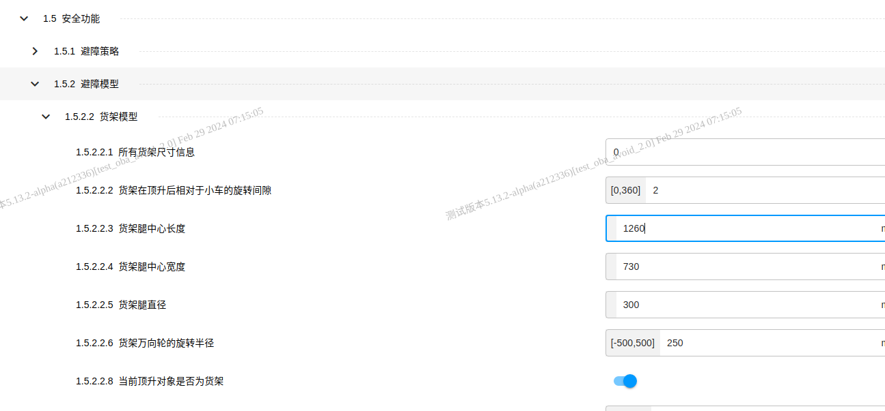
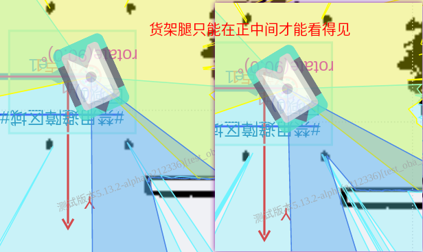
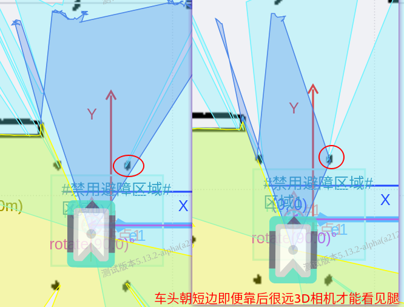

## 避障2.0后端提测问题汇总

- [ ] 5.13.0本身的深度相机的tf到策略不对，雷达正常的？ 5.116测试obstacle不发出tf对避障的影响

 		实际策略打印不会出现 不影响策略

- [ ] 货架底部避障雷达旋转避障在20cm附近    stop_forward_offset？修改为0   

- [ ] ms500后雷达近距离障碍物检测不到，数据闪现

- [ ] 新版本 core文件在哪里？

- [ ] 加入凯哥的分支后出现避障点不在避障模型以内；

- [ ] 相机远处打到地面左右不一致（标定问题不准）

3. 3d相机视野显示的点云输出的部分
4. 手动模式也有避障模式，排查问题时候可以开手动模式去复现一下
5. 高度滤波：如果高于车高一点 可能误避障 原因是

1.修复重构相机避障点不刷新问题

1.同步旋转时候 必须为车体   放在避障控制不合适 需要同步旋转信息和路径信息   旋转延时去不掉

顶升 410   自定义顶升 4-11-50

下降 420

同步旋转 4-13-0 关闭同步旋转 4-14-0

电量不足就会出现这个 电充满又好了

​    output_points.reserve(points_in_sensor.size());  

​    output_points = std::move(points_in_sensor);

​    output_points.swap(base_robots_points);

​    output_points = points_in_sensor;

