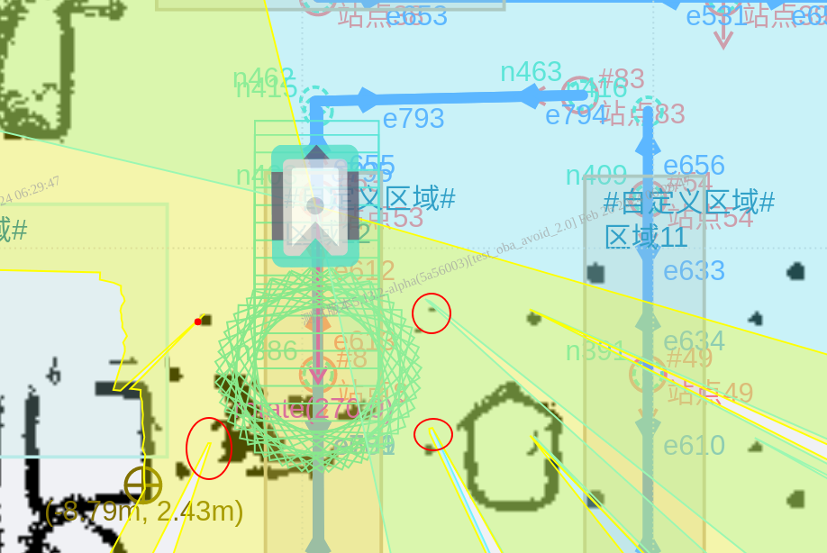
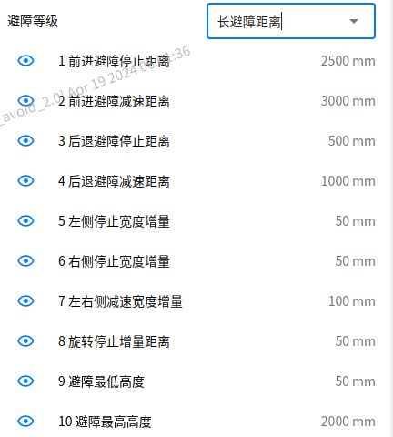
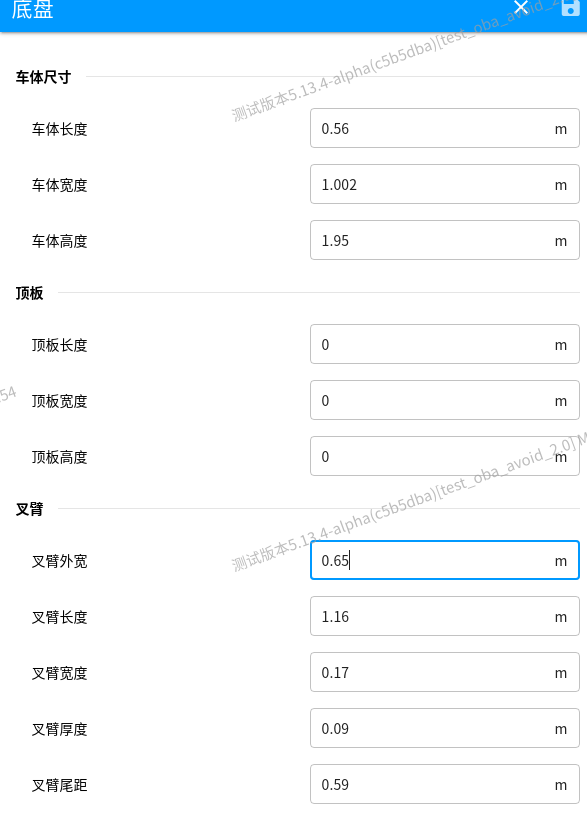

## 避障2.0后端提测问题汇总

* [ ] 5.13.0本身的深度相机的tf到策略不对，雷达正常的？ 5.116测试obstacle不发出tf对避障的影响

* [ ] 货架底部避障雷达旋转避障在20cm附近    stop\_forward\_offset？修改为0

* [ ] ms500后雷达近距离障碍物检测不到，数据闪现

* [ ] 新版本 core文件在哪里？

* [ ] 加入凯哥的分支后出现避障点不在避障模型以内；



* [ ] 相机远处打到地面左右不一致（标定问题不准）


3. 3d相机视野显示的点云输出的部分
4. 手动模式也有避障模式，排查问题时候可以开手动模式去复现一下
5. 高度滤波：如果高于车高一点 可能误避障 原因是


​    output\_points.reserve(points\_in\_sensor.size());

​    output\_points = std::move(points\_in\_sensor);

​    output\_points.swap(base\_robots\_points);

​    output\_points = points\_in\_sensor;


**叉车误避障**

**问题点**：

* [ ] 打到叉臂内侧；
* [ ] 中心区域（0，0）没去除掉；


#### 动作汇总

1.同步旋转时候 必须为车体   放在避障控制不合适 需要同步旋转信息和路径信息   旋转延时去不掉

顶升 410   自定义顶升 4-11-50

下降 420

同步旋转 4-13-0 关闭同步旋转 4-14-0

手动旋转 4-12-900/0

| 命令     | 一句话功能描述         | 适用场景                   | 备注 |
| -------- | ---------------------- | -------------------------- | ---- |
| 136-0-0  | 上视二维码前向矫正     | 不旋转顶升取货架           |      |
| 136-0-8  | 上视基于货架腿前向矫正 | 基于雷达，不旋转顶升取货架 |      |
| 136-1-0  | 上视二维码后向矫正     | 不旋转顶升取货架           |      |
| 136-1-8  | 上视基于货架腿后向矫正 | 基于雷达，不旋转顶升取货架 |      |
| 136-2-0  | 下视二维码前向矫正     | 站点位置校正               |      |
| 136-3-0  | 下视二维码后向矫正     | 站点位置校正               |      |
| 136-6-0  | 下视纹理前向矫正       | 站点位置校正               |      |
| 136-7-0  | 下视纹理后向矫正       | 站点位置校正               |      |
| 136-10-x | 码带精校正             | 窄通道高精度移动           |      |
| 136-20-x | 码带粗校正             | 窄通道高精度移动           |      |


叉臂抬升动作


文静避障策略代码(问题点):

- ```c++
          double car_body_center_x = obstacle_avoid_para.car_body_.center_x / 2.0 +
                                     obstacle_avoid_para.left_fork_.center_x / 2.0;
  ```

  


#### 避障场景

路网导航避障 → 对接避障 → 手动避障





**没有用**

0,nav.enable_path_oba,nav.detect_low_offset,最低避障高度增量,0,0,m,float,**"[0.0,0.3]",**避障低矮物体高度增量,,,1,0,0,0,0,0,**14,**,,,99,1

0,nav.enable_path_oba,nav.detect_height_offset,最高避障高度增量,0,0,m,float,**"[-0.1,0.3]",**避障高度增量,,,1,0,0,0,0,0,**15,**,,,99,1


前雷达注意 有奥瑞达(2007)和倍加福 (6060)


#### 叉车测试:

- [ ] 162关闭雷达后也要发空数据,策略不会刷新然后报避障,而且点还是闪烁在动的





型号：Oasis600E-C0118

车体尺寸：长950mm 宽635mm 高250mm        1460 930


rack:1460 1229


### 避障2.0待修复问题(明确)

- [ ] 检测范围动态
- [ ] 目标栈板过滤


#### 顶升业务流程：

- 同步旋转开启时候
- 410动作理解
- 平行背负还是垂直背负，部署要怎么的？


max_z1 = 车体高度（车体+顶板） + 顶升高度(5cm) +货架高度(rack.max_contour_height) - 净空高度(ack.leg_length)rack.bearing_surface_length

max_z2 = 货架高度(rack.max_contour_height)  + 货架腿到地面（rack.bearing_surface_length）


#### 避障2.0发布前一个迭代：

- 货架非对称没刷新加在加在车体

- 叉车下发货架载货状态下参数没配对导致core dump 

- 车体非对称修改

- 叉车车体高度上装设置为0

  


