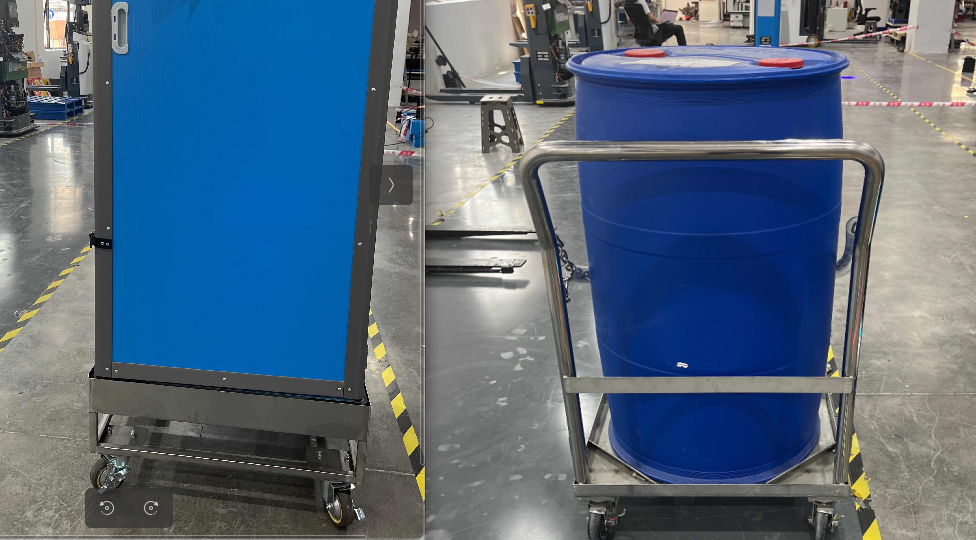

## 牵引车料车识别方案

> #### 对接场景及对接物
>
> ​	==及其改场景下的避障处理==
>
> 1. 潜伏车顶货场景 --- 货架 
> 2. 潜伏车顶货场景 ---  接驳台/托盘
> 3. 叉车取放货场景  ---  栈板
> 4. 牵引车牵引场景  --- 料车
>

#### 料车几何形态

#### 

料车的两大类：镂空和竖面的

#### 点云特征提取

- 轮子特征

- 下沿杠

- 竖边缘

  

思路：

- 基于点云模版匹配
- 特征拟合方式
