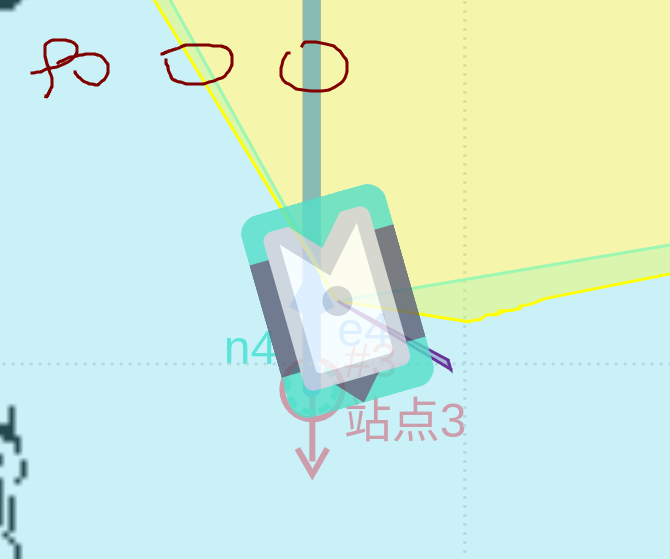

# 工作记录(一)

> ******

### 1.工作安排()：

- [ ] 

- [ ] 

  

### 2.时间安排：

**label :**  **基本完成**      **部分完成**      **一点未做**

| 日期：     | 工作项：                                                    | key  |
| ---------- | ----------------------------------------------------------- | ---- |
| 4.1    Mon | 1.避障2.0的策略代码解读 2.3D相机的方案设计                  |      |
| 4.2    Tue | 1.小米现场多货架切换逻辑梳理; 2.避障避障2.0的-避障模型生成; |      |
| 4.6    Mon |                                                             |      |
| 4.7    Tue | 1.sros容器段点没调试好                                      |      |
|            |                                                             |      |
|            |                                                             |      |
|            |                                                             |      |
|            |                                                             |      |
|            |                                                             |      |
|            |                                                             |      |
|            |                                                             |      |
|            |                                                             |      |
|            |                                                             |      |
|            |                                                             |      |
|            |                                                             |      |
|            |                                                             |      |
|            |                                                             |      |
|            |                                                             |      |
|            |                                                             |      |
|            |                                                             |      |
|            |                                                             |      |
|            |                                                             |      |
|            |                                                             |      |
|            |                                                             |      |
|            |                                                             |      |
|            |                                                             |      |
|            |                                                             |      |
|            |                                                             |      |
|            |                                                             |      |

90 -90 0

-316;-300;340;0;-90;0;

obstacle.ust_left_angle_ma

- 潜伏牵引和后牵引纯点云对接算法开发；
- 华为多线激光雷达避障优化和避障处理；
- 避障2.0后期非标现场支持；
- 常规避障问题分析和解决；
