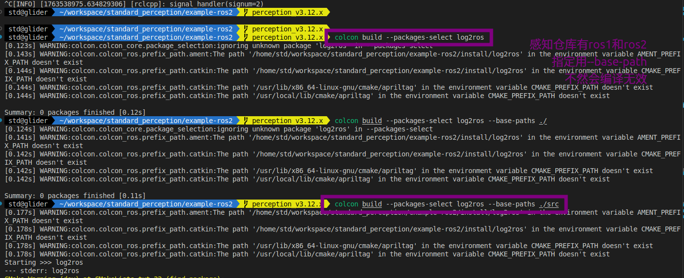

# ROS2

## 常用语法：

```zsh
# source ~/turtlebot3_ws/install/setup.zsh
# source ~/workspace/test_pkg_ws/install/setup.zsh
# source ~/workspace/standard_perception/example-ros2/install/setup.zsh
# source /home/std/workspace/neo_simulation2_ws/install/setup.zsh
# source /home/std/workspace/ur_ws/install/setup.zsh

```


## 问题汇总：

- [ ] 感知仓库包含ros1和ros2情况下，colcon build无效情况；

