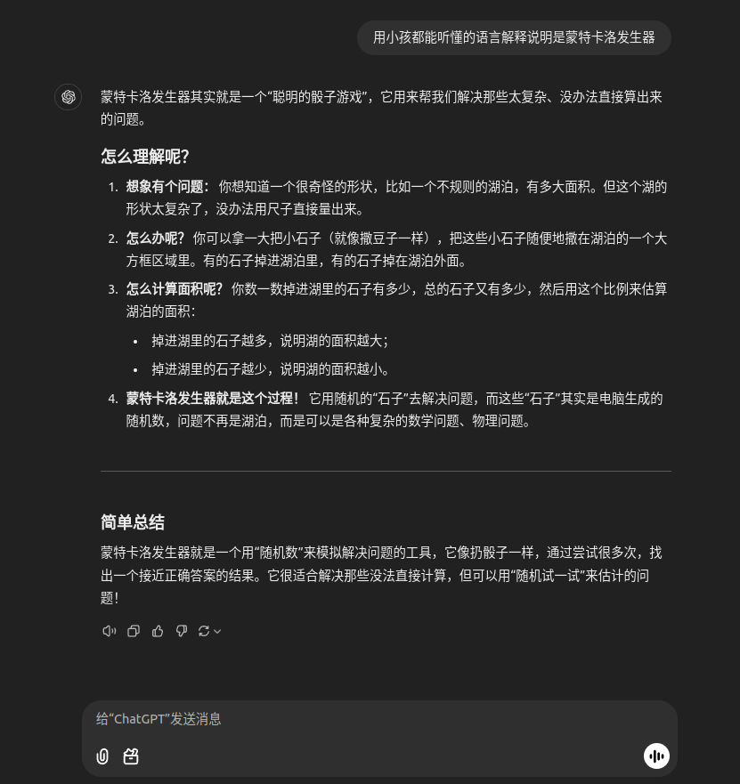
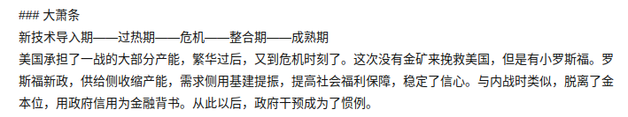

### 读书笔记

<<小米的创业思考>>

- “有所为，有所不为” 克制贪婪，少就是多 
- 决定不做什么跟决定做什么一样重要
- “终于明白啥叫‘极致’了，极致就是把自己逼疯，把竞争对手逼死”。

**蒙特卡洛发生器**

《[美国四百年](https://book.douban.com/review/14381392/)》

1. 经济危机解释：和血液循环一样 产品过剩 不流通 导致各环节堵塞

   

2. 现在的ai行业 可以类比电气时代 互联网时代

3. 

