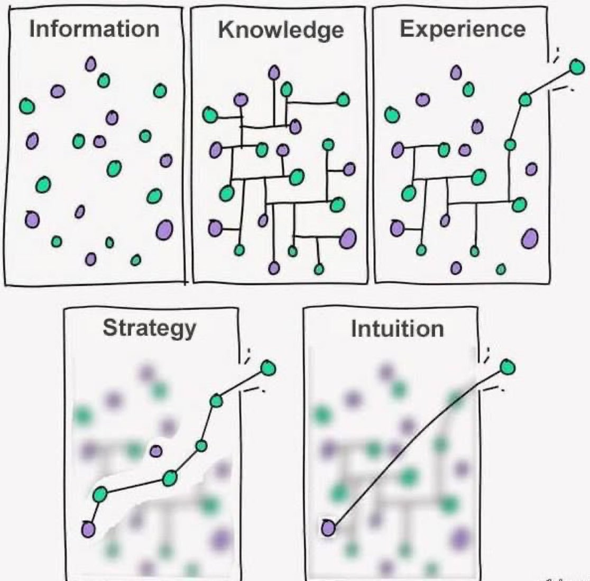

# 系统学习及资源

#### 1.学习五阶段

| **阶段**      | **图示特征**                                      | **学习含义**                                                                 | **核心过程**         | **深度解读**                                                                                     |
|---------------|--------------------------------------------------|-----------------------------------------------------------------------------|---------------------|-------------------------------------------------------------------------------------------------|
| **信息 (Information)** | 紫色和绿色圆点散乱分布，无明显关联。              | 学习的起点，接触大量原始、未整理的数据或信息。                                | 获取信息            | 这一阶段是学习的初步，信息尚未经过加工，学习者处于被动接收状态，信息之间缺乏逻辑联系，类似“碎片化学习”。比如阅读大量文章但未整理笔记。 |
| **知识 (Knowledge)**   | 圆点通过线条连接，形成网络结构。                  | 信息被整理和关联，形成知识体系，理解信息之间的关系。                          | 分析与归纳          | 学习者开始主动整理信息，建立概念框架，比如将零散的历史事件按时间线梳理，或将数学公式归类为一个体系。知识的形成需要逻辑思维和结构化能力。 |
| **经验 (Experience)**  | 网络结构更复杂，线条动态，部分带有箭头。          | 通过实践和反复应用知识，积累个人化经验，加深理解。                            | 实践与应用          | 知识通过实际操作内化，比如通过做题掌握公式，或在工作中应用理论。经验让学习者从“知道”到“做到”，并开始形成解决问题的能力。 |
| **策略 (Strategy)**    | 一条清晰路径穿过网络，连接关键圆点。              | 在经验基础上，找到解决问题的最优路径，学会高效方法。                          | 优化与选择          | 学习者开始总结经验，提炼出高效的解决方案，比如在学习中找到重点章节，或在工作中制定优先级。策略阶段强调效率和目的性，减少试错成本。 |
| **直觉 (Intuition)**   | 一条简洁直线穿过复杂网络，直达目标。              | 学习的最高境界，知识和经验内化，能够不假思索地做出正确判断。                  | 无意识熟练          | 直觉是长期积累的结果，学习者在大量实践后形成“肌肉记忆”或“本能反应”，比如专家能迅速判断问题本质，或熟练工匠不经思考完成复杂操作。 |

这五个阶段展示了学习从浅到深的递进：从被动获取信息到主动构建知识，再通过实践积累经验，优化为策略，最终内化为直觉。每个阶段都建立在前一阶段的基础上，反映了学习的系统性和渐进性。

#### 2.对 "Knowledge" 一词的拆解与哲学思考

**一、构词法拆解**

**Knowledge = know + ledge**

- **know**：动词，意思是“知道、了解”
- **ledge**：在这里不是常规的 “ledge” 词义（岩架等），而是抽象名词后缀的演化形式，表示“状态”或“集合”

📌 所以 **knowledge** 表层意思为：“知道的状态”或“所知道的东西”，即 **“知识”**。

**二、词源分析**

“Knowledge” 源自古英语 **cnāwleċe**，其构成为：

- **cnāwan**：表示“知道”  
- 抽象名词后缀 **-leċe**（后来演化为 -ledge）

🧠 原始意义为：  
**the act, fact, or state of knowing**  
（知道的行为、事实或状态）

---

**三、“ledge” 和 “edge” 的关系**

虽然两个词在拼写上相似，但：

- **“ledge”** 在 knowledge 中是古英语抽象名词后缀的演化，不是 **“edge”**
- **edge** 是“边缘”，来自不同词源，意义也完全不同

📎 所以：  
**knowledge 中的 -ledge 与 edge 并无词义联系**，只是语言演化中的巧合。

---

**四、哲学性理解：“知识是知道的边界”**

✨ 这是一个极富启发性的解释，虽然不符合词源，但在哲学上很深刻：

- **edge（边界）** 是一种象征，表示认知范围的尽头  
- **knowledge** 可理解为 “我们已知世界的边界”  
- **当知识增加，接触未知的边缘也在扩大**  
- 类似于一个发光的圆圈，圆圈越大，触及黑暗（未知）的边也越多

🌀 所以：

> **Knowledge = know 的 edge = 知道的边界**

这是一种 **哲学性、象征性的理解**，非常适合用于写作、演讲、思辨等场合。

#### 优质资料

[1.高翔系统《《自动驾驶中的SLAM技术》对应开源代码》](https://github.com/gaoxiang12/slam_in_autonomous_driving?tab=readme-ov-file)

[相机和多线雷达手动标定](https://github.com/tdcsu/clm/tree/main)

[**雷达人腿检测**](https://gitee.com/ncnynl/ros2_leg_detector)

#### 机器人系统学习

1.[**automatic addison**](https://automaticaddison.com/tutorials/)

2.[**NVIDIA Isaac ROS**](https://nvidia-isaac-ros.github.io/index.html)
