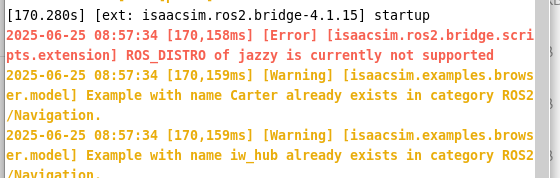
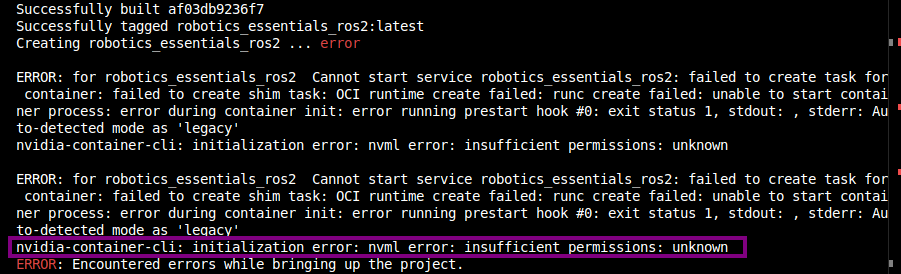
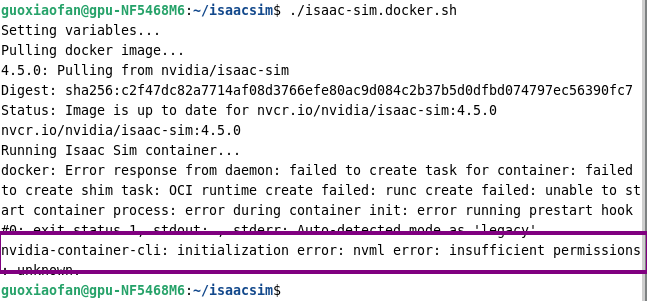
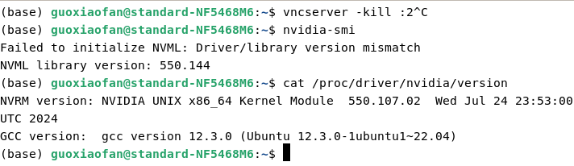
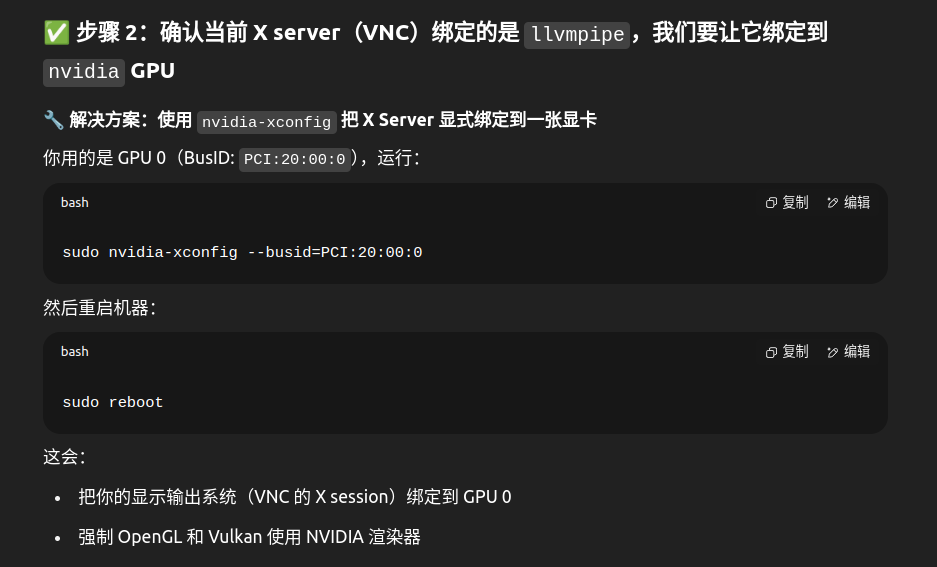
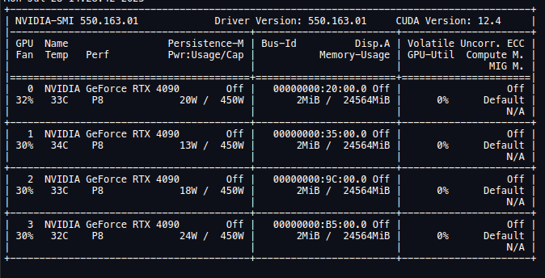
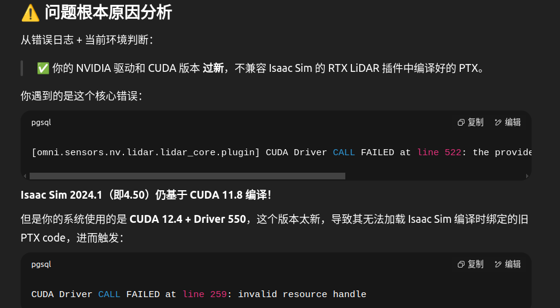

## ISAAC-SIM配置及使用


### 安装踩坑记录：

- #### **服务器系统（ubuntu24.04）安装ros2  jazz，运行isaac-sim4.5，启用ros桥接 发现版本不兼容，必须用humble版本**




- #### **docker运行（ubuntu22.04）），发现NVIDIA Container Toolkit不能调用底层的库**

  

  

  配置了 `nvidia-container-toolkit` 和 Docker runtime，但是仍然报错：

  ```
  go
  nvidia-container-cli: initialization error: nvml error: insufficient permissions
  ```

  这意味着 **容器仍然无法访问主机的 NVIDIA 驱动层（NVML）**。这不是普通的配置问题，而是**设备权限问题 + 系统不兼容问题的复合错误**。


近段时间用isaac-sim4.5版本时候 发现用ubuntu24.04有很多坑（isaac-sim4-ubuntu发行版本-rosbrige-ros2尽量适配）建议用稳定的22.04版本，包括ros2-jazzy不够稳定  现在服务器大家还没有大量用情况下 建议要是能装回22.04就装回去


- #### **驱动和库不匹配问题**

  

  ```
  sudo apt purge nvidia*
  sudo apt autoremove
  sudo apt install nvidia-driver-550
  sudo reboot
  ```

- #### **isaac-sim加载例子后界面卡顿**

  根本原因：vnc虚拟桌面渲染要绑定gpu加速

(base) guoxiaofan@standard-NF5468M6:~$ glxinfo | grep -i "renderer"
    GLX_MESA_copy_sub_buffer, GLX_MESA_query_renderer, GLX_MESA_swap_control, 
    GLX_MESA_query_renderer, GLX_OML_swap_method, GLX_SGIS_multisample, 
Extended renderer info (GLX_MESA_query_renderer):
OpenGL renderer string: llvmpipe (LLVM 15.0.7, 256 bits)

(base) guoxiaofan@standard-NF5468M6:~$ sudo nvidia-xconfig --busid=PCI:20:00:0

WARNING: Unable to locate/open X configuration file.

Package xorg-server was not found in the pkg-config search path.
Perhaps you should add the directory containing `xorg-server.pc'
to the PKG_CONFIG_PATH environment variable
No package 'xorg-server' found
New X configuration file written to '/etc/X11/xorg.conf'



- #### **运行ros2brige 雷达ros2话题插件启动不了（相机数据正常）**

```
[omni.sensors.nv.lidar.lidar_core.plugin] CUDA Driver CALL FAILED at line 259: invalid resource handle
2025-07-25 10:12:06 [84,832ms] [Error] [omni.sensors.nv.lidar.lidar_core.plugin] CUDA Driver CALL FAILED at line 259: invalid resource handle
```

当前：






**ros2 humble 标准安装**

https://docs.ros.org/en/humble/Installation/Ubuntu-Install-Debs.html