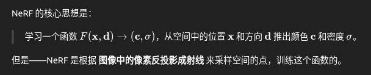

### 专业常识

| 输入    | 方法             | 输出                | 尺度是否真实？           | 应用场景             |
| ------- | ---------------- | ------------------- | ------------------------ | -------------------- |
| 3D → 3D | ICP              | R, t                | ✅ 是                     | 点云配准、位姿调整   |
| 3D → 2D | PnP              | R, t                | ✅ 是（若 3D 是真实单位） | 相机定位、AR         |
| 2D → 2D | 本质矩阵 / F矩阵 | R, t（up-to-scale） | ❌ 无尺度                 | SfM、VO、SLAM 初始化 |

| 矩阵  | 名称                           | 用于                       | 是否需要相机内参？ | 作用                                |
| ----- | ------------------------------ | -------------------------- | ------------------ | ----------------------------------- |
| **F** | 基础矩阵（Fundamental Matrix） | **像素坐标之间的几何约束** | ❌ 不需要           | 描述图像之间的对应点关系            |
| **E** | 本质矩阵（Essential Matrix）   | **相机坐标系下的几何约束** | ✅ 需要内参（K）    | 描述相机间相对运动（R,t）的几何关系 |

内参：相机投影模型来反推出光线

你用一张图像喂给 NeRF：

1. 它会根据内参 K 把每个像素 (u,v)(u,v)(u,v) 反投影成一条光线
2. 再根据相机的 R, t（外参），把这条光线转换到世界坐标系中
3. 沿这条光线在 3D 空间中采样若干点
4. 将这些点输入神经网络预测密度和颜色
5. 最后通过体渲染公式合成出图像像素颜色，和原图监督误差
