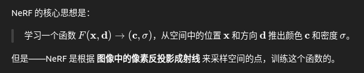
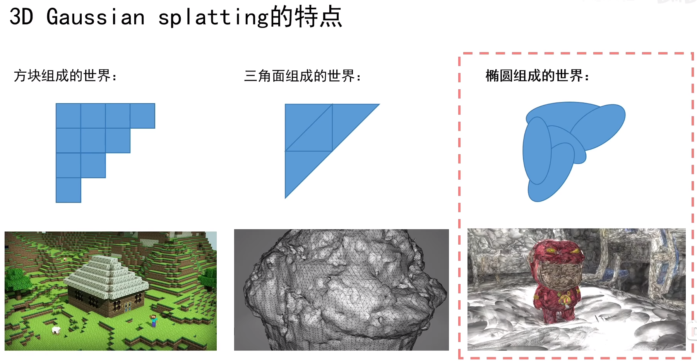
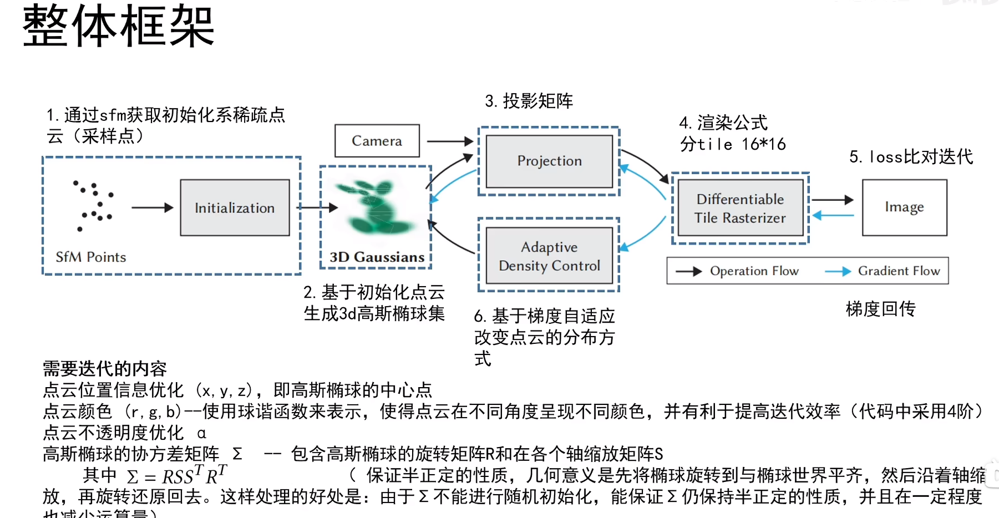
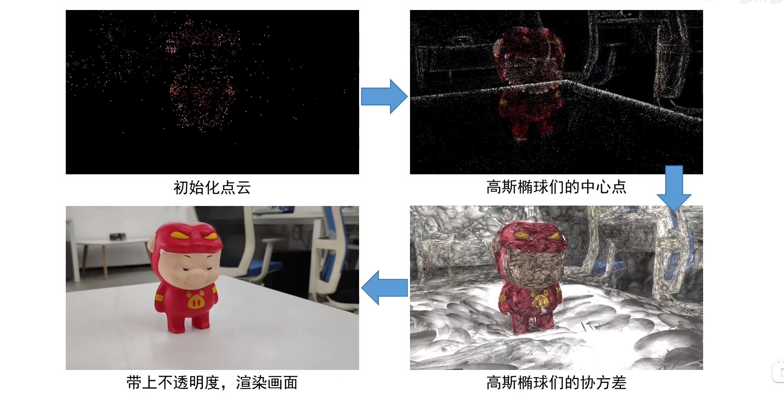

# 专业常识

### **三维重建：**

| 输入    | 方法             | 输出                | 尺度是否真实？           | 应用场景             |
| ------- | ---------------- | ------------------- | ------------------------ | -------------------- |
| 3D → 3D | ICP              | R, t                | ✅ 是                     | 点云配准、位姿调整   |
| 3D → 2D | PnP              | R, t                | ✅ 是（若 3D 是真实单位） | 相机定位、AR         |
| 2D → 2D | 本质矩阵 / F矩阵 | R, t（up-to-scale） | ❌ 无尺度                 | SfM、VO、SLAM 初始化 |

==**注：**==时空表示 时间为移动（  SfM） 空间为双目标定

| 矩阵  | 名称                           | 用于                       | 是否需要相机内参？ | 作用                                |
| ----- | ------------------------------ | -------------------------- | ------------------ | ----------------------------------- |
| **F** | 基础矩阵（Fundamental Matrix） | **像素坐标之间的几何约束** | ❌ 不需要           | 描述图像之间的对应点关系            |
| **E** | 本质矩阵（Essential Matrix）   | **相机坐标系下的几何约束** | ✅ 需要内参（K）    | 描述相机间相对运动（R,t）的几何关系 |

内参：相机投影模型来反推出光线

你用一张图像喂给 NeRF：

1. 它会根据内参 K 把每个像素 (u,v)(u,v)(v) 反投影成一条光线
2. 再根据相机的 R, t（外参），把这条光线转换到世界坐标系中
3. 沿这条光线在 3D 空间中采样若干点
4. 将这些点输入神经网络预测密度和颜色
5. 最后通过体渲染公式合成出图像像素颜色，和原图监督误差

**输出ply字段:**

| 字段       | 说明       | 是否能在 CloudCompare 显示 |
| ---------- | ---------- | -------------------------- |
| `x,y,z`    | 点的位置   | ✅ 默认                     |
| `f_dc_0~2` | 类 RGB     | ✅ 可手动映射               |
| `opacity`  | 渲染权重   | ✅ 可视化 Scalar Field      |
| `scale_*`  | 尺度       | ✅ 可视化体积分布           |
| `rot_*`    | 方向四元数 | ❌（需转换）                |
| `f_rest_*` | 高阶 SH    | ❌ 用于渲染，非直观显示     |

[**渲染Gaussian Splat PLY 文件**](https://superspl.at/editor?load=https://raw.githubusercontent.com/willeastcott/assets/main/biker.ply)

### **6D位姿估计：**

#### **参考资料：**

**[1.最新综述！基于深度学习的6D位姿估计](https://zhuanlan.zhihu.com/p/699695765)**

### Question: 

- [ ] 单目深度估计需要内参吗？如果不需要，假如多个相机在同一个位置拍摄相同的物体得到的深度图一样吗？

